# Supporting Information

## Superstructure Optimization of Waste Plastic Pyrolysis: Integrating Thermal, Catalytic, and Plasma Technologies with Machine Learning

**Authors:** [Author names]

**Affiliation:** [Department, University]

**Corresponding Author:** [Email]

---

## Abstract

This Supporting Information provides detailed documentation of the superstructure optimization framework for waste plastic recycling via pyrolysis. The integrated process considers four upstream conversion technologies (thermal oxodegradation, conventional pyrolysis, catalytic pyrolysis, and plasma pyrolysis) with shared downstream separation and upgrading (fractional distillation, hydrocracking, and fluid catalytic cracking). A feedforward neural network (PyrolysisNet) predicts product yields from feedstock composition and operating conditions. Multi-objective optimization (minimum selling price and global warming potential) is performed across four price scenarios using Nelder-Mead with a weighted-sum objective. Complete process descriptions, economic assumptions, environmental impact methodology, and optimization results are provided herein.

---

## Table of Contents

| Section | Title | Page |
|---------|-------|------|
| S1 | [Process Description & Superstructure Topology](S1_process_description.md) | - |
| S2 | [Machine Learning Model Development](S2_machine_learning.md) | - |
| S3 | [Techno-Economic Analysis](S3_tea.md) | - |
| S4 | [Life Cycle Assessment](S4_lca.md) | - |
| S5 | [Product Price Scenarios](S5_prices.md) | - |
| S6 | [Optimization Results](S6_optimization_results.md) | - |
| S7 | [Sensitivity & Contour Analysis](S7_sensitivity_contours.md) | - |

---

## List of Figures

| Figure | Description | Location |
|--------|-------------|----------|
| Figure S1 | Superstructure process flow diagram | `system_diagram_thorough.png` |
| Figure S2 | ML model parity plots (8 panels) | `machine_learning/plots/parity_*.png` |
| Figure S3 | Temperature sweep parametric study | `machine_learning/plots/temperature_sweep.png` |
| Figure S4 | Vapor residence time sweep | `machine_learning/plots/vrt_sweep.png` |
| Figure S5 | Feedstock composition sensitivity | `machine_learning/plots/composition_sweep.png` |
| Figure S6 | Phase distribution (stacked area) | `machine_learning/plots/phase_stacked.png` |
| Figure S7 | Reactor type comparison | `machine_learning/plots/reactor_comparison.png` |
| Figure S8 | Optimization contour plots (MSP, GWP, CAC) | `contours.png` |

## List of Tables

| Table | Description | Section |
|-------|-------------|---------|
| Table S1 | US MSW plastic feed composition | S1 |
| Table S2 | Upstream pathway operating conditions | S1 |
| Table S3 | TOD fixed product yields | S1 |
| Table S4 | Distillation column specifications | S1 |
| Table S5 | Equipment list by pathway | S1 |
| Table S6 | PyrolysisNet architecture | S2 |
| Table S7 | ML model performance metrics | S2 |
| Table S8 | Gas compound mapping | S2 |
| Table S9 | Liquid sub-category compound mapping | S2 |
| Table S10 | TOD correction coefficients | S2 |
| Table S11 | Catalytic correction coefficients | S2 |
| Table S12 | Plasma correction coefficients | S2 |
| Table S13 | TEA financial assumptions | S3 |
| Table S14 | Labor cost breakdown | S3 |
| Table S15 | Operating cost factors | S3 |
| Table S16 | LCA emission factors (GWP) | S4 |
| Table S17 | Stream-to-resource mapping | S4 |
| Table S18 | Product prices (low/baseline/high) | S5 |
| Table S19 | Scenario definitions | S5 |
| Table S20 | Optimal split fractions by scenario | S6 |
| Table S21 | TEA results by scenario | S6 |
| Table S22 | LCA results by scenario | S6 |
| Table S23 | Sales by product group | S6 |
| Table S24 | Organics revenue breakdown | S6 |


```{=openxml}
<w:p><w:r><w:br w:type="page"/></w:r></w:p>
```

# S1. Process Description & Superstructure Topology

## S1.1 Superstructure Architecture

The superstructure integrates four upstream plastic conversion technologies with three downstream separation/upgrading processes through a network of four optimization splitters. The process flow diagram is shown in Figure S1.


```
HDPE/LDPE/PP/PS Feed (250 tpd)
        |
   Splitter1 (split_TOD: fraction to CP+TOD)
      /                    \
  Splitter3              Splitter2 (split_CPY: fraction to CPY)
  (split_CP:               /              \
   fraction to TOD)      CPY             PLASMA
    /       \          (catalytic)      (plasma)
  TOD       CP
   \       /
   Mixer (SS_mx_pyro)
      |
  DISTILLATION
      |
  Wax -> WaxSplitter (split_HC: fraction to HC)
           /          \
         HC           FCC
```

Product streams are merged across pathways:
- **Naphtha**: DISTILLATION + HC + FCC
- **Diesel**: DISTILLATION + HC + FCC
- **Wax**: HC + FCC (residual heavy fraction)
- **BTX**: CPY (Benzene + Toluene + Xylene)
- **Hydrogen**: HC + FCC (excess H2)
- **Organics**: PLASMA (Paraffins, Carbonyls, Olefins, Alcohols, Acids, C30)

A turbogenerator combusts combined flue gas from CPY, PLASMA, and FCC to generate electricity.

## S1.2 Feed Composition

**Table S1.** US average MSW plastic feed composition (pyrolysis-eligible fraction).

| Resin | Weight Fraction | Raw US MSW (wt%) | Notes |
|-------|----------------|-------------------|-------|
| LDPE/LLDPE | 0.442 (44.2%) | 34% | Bags, film, flexible packaging |
| PP | 0.234 (23.4%) | 18% | Containers, automotive parts |
| HDPE | 0.220 (22.0%) | 17% | Bottles, jugs |
| PS | 0.104 (10.4%) | 8% | Foam, disposables |

PET (12%), PVC (5%), and other (6%) are excluded from the pyrolysis feed. PET produces oxygenated decomposition products incompatible with the hydrocarbon-focused separation train; PVC generates corrosive HCl. The remaining 77 wt% is renormalized to 100%.

**Sources:** Milbrandt et al. (2022), *Resources, Conservation and Recycling*, 183, 106363; National Academies / ACC (2021); Geyer et al. (2017), *Science Advances*, 3(7), e1700782.

**Feedstock price:** $0.02/kg waste plastic.

**Plant capacity:** 250 tonnes per day (10,417 kg/hr).

## S1.3 Upstream Technology Descriptions

### S1.3.1 Thermal Oxodegradation (TOD)

TOD operates via autothermal pyrolysis using a fluidized bed reactor with oxygen co-feed. The exothermic oxidation reactions provide the heat needed for thermal decomposition, eliminating the need for an external furnace.

**Table S2.** TOD operating conditions.

| Parameter | Value |
|-----------|-------|
| Reactor type | RYield (fixed yields) |
| Temperature | 600 °C (873.15 K) |
| Pressure | 1 atm |
| O2 equivalence ratio | 7% of feed mass |
| Fluidizing gas | N2, 15 kg/hr |
| Reactor cost scaling factor | 0.4 |

**Unit operations:** Feed_handling -> Grinder -> Screen (with recycle) -> Mixer (feed + O2 + N2) -> RYield Reactor -> Cyclone (99% efficiency) -> Cooler (10 °C)

**Table S3.** TOD fixed product yields (mass fraction of feedstock).

| Product | Yield (wt/wt) |
|---------|---------------|
| Ash | 0.003 |
| CO | 0.00833 |
| CO2 | 0.06517 |
| H2 | 0.000270 |
| CH4 | 0.00444 |
| C2H4 | 0.02633 |
| C3H8 | 0.01666 |
| C4H8 | 0.01622 |
| C10H22 (naphtha) | 0.0769 |
| C14H30 (diesel) | 0.0431 |
| C24H50 (wax) | 0.3735 |
| C40H82 (heavy wax) | 0.3364 |
| O2 (consumed) | 0.00257 |
| **Total** | **~97.0%** |

The mass balance closure is 90.4% (parameter `wt_closure`); the remainder is attributed to uncharacterized light species.

### S1.3.2 Conventional Pyrolysis (CP)

CP uses thermal pyrolysis under inert N2 atmosphere (no oxygen feed). Product yields are predicted by the PyrolysisNet ML model with `reactor_type='thermal'`.

| Parameter | Value |
|-----------|-------|
| Reactor type | Pyrolyzer (ML-predicted yields) |
| Temperature | 500 °C (773.15 K) |
| Pressure | 1 atm |
| Vapor residence time | 1.0 s |
| ML reactor type | `thermal` (base model, no correction) |
| Fluidizing gas | N2, 15 kg/hr |

**Unit operations:** Feed_handling -> Grinder -> Screen (with recycle) -> Mixer (feed + N2) -> Pyrolyzer -> Cyclone (99%) -> Cooler (10 °C)

### S1.3.3 Catalytic Pyrolysis (CPY)

CPY uses zeolite-catalyzed pyrolysis to produce aromatics-rich products. Product yields are predicted by PyrolysisNet with `reactor_type='catalytic'`, which applies a linear additive correction derived from the aston.xlsx literature database.

| Parameter | Value |
|-----------|-------|
| Reactor type | Pyrolyzer (ML + catalytic correction) |
| Temperature | 500 °C (773.15 K) |
| Pressure | 1 atm |
| Vapor residence time | 1.0 s |
| ML reactor type | `catalytic` |
| O2 equivalence ratio | 7% |
| Fluidizing gas | N2, 15 kg/hr |

**Unit operations:** Feed_handling -> Grinder -> Screen (with recycle) -> Mixer -> Pyrolyzer -> Cyclone -> Cooler (10 °C) -> Flash F0 (10 °C) -> Pump -> Flash F1 (285 K) -> D1-D4 aromatics distillation train -> Product coolers

**CPY Distillation train:**
- D1: BinaryDistillation, LHK = C6H6/C7H8 (Benzene separation)
- D2: BinaryDistillation, LHK = C7H8/C8H18, Lr=0.95, Hr=0.95 (Toluene separation)
- D3: BinaryDistillation, LHK = C8H18/C8H10 (Aromatics separation)
- D4: BinaryDistillation, LHK = C8H10/PS, Lr=0.95, Hr=0.95 (Xylene separation)

All CPY columns use `check_LHK=False` and fixed purchase costs of $320,258 per column.

**Products:** Benzene, Toluene, Aromatics (other), Xylene, FlueGas (from F0 vapor).

### S1.3.4 Plasma Pyrolysis (PLASMA)

PLASMA converts waste plastic via non-equilibrium CO2 plasma, producing oxygenated products (alcohols, acids, carbonyls) alongside conventional hydrocarbons. CO2 is incorporated into products, causing total yields to exceed 100% of feedstock mass (CO2 factor ~1.298).

| Parameter | Value |
|-----------|-------|
| Reactor type | PlasmaReactor (ML-predicted yields) |
| Temperature | 400 °C (reactor); ML queried at 450 °C virtual temperature |
| CO2 feed ratio | 0.30 kg/kg plastic |
| O2 feed ratio | 0.05 kg/kg plastic |
| Vapor residence time | 20.0 s |
| Power consumption | 0.111 kW per kg/hr feed |
| CO2 factor | 1.298 (total yield/feedstock mass) |

**Reference:** Radhakrishnan et al. (2024), *Green Chem.*, 26, 9156-9175 (Case G: CO2 plasma, tR = 20 s).

**Unit operations:** Mixer (feed + CO2 + O2 + recycle) -> PlasmaReactor -> Condenser (32 °C) -> Flash (200 °C, heavy/light split) -> Heavy separation train -> Light recovery train (compression to -78 °C) -> Alcohol/Acid/Carbonyl fractionation -> Steam methane reforming -> Hydrocracking of C30+ fraction -> Recycle loop (90% recycle split)

**Products:** Paraffins (C18H38), Carbonyls (C14H22O), Olefins (light hydrocarbons), Alcohols (1-Dodecanol), Acids (fatty acid), C30 (heavy wax).

## S1.4 Downstream Technology Descriptions

### S1.4.1 Fractional Distillation (DISTILLATION)

Shared separation train for the combined TOD + CP pyrolysis product. Separates cooled crude vapor into six product fractions.

**Table S4.** Distillation system specifications.

| Unit | Type | Separation | Key Details |
|------|------|------------|-------------|
| F1 (Condenser) | Flash | Initial condensation | T = 10 °C, P = 1 atm |
| H7 | Heater | Re-heat condensate | T = 150 °C |
| F3 (FlashSep) | Flash | Gas/liquid split | T = 0 °C, P = 1.01 atm |
| K1, K2 | Compressors | Gas compression | 2 atm, then 7 atm; eta = 0.8 |
| F2 | Flash | Deep cooling | T = -110 °C, P = 7 atm |
| D1 (De-ethanizer) | BinaryDistillation | C2H4/C3H8 | y_top = 0.99, x_bot = 0.01 |
| D2 (Depropanizer) | BinaryDistillation | C3H8/C4H8 | y_top = 0.99, x_bot = 0.01 |
| D3 (Debutanizer) | Tb-cutoff Splitter | Tb < Tb(C10H22) | Butene/heavier cut |
| D4 (NaphthaSplitter) | Tb-cutoff Splitter | Tb < Tb(C14H30) | Naphtha/diesel cut |
| D5 (DieselSplitter) | Tb-cutoff Splitter | Tb < Tb(C24H50) | Diesel/wax cut |

D1 and D2 use rigorous BinaryDistillation because their LHK compounds (C2H4/C3H8, C3H8/C4H8) are always present in the compressed-gas path. D3, D4, and D5 use boiling-point-based component splitting (Tb-cutoff Splitters) for robustness against variable feed compositions. F3 liquid (0 °C condensate) is routed through D4 for proper naphtha/diesel/wax classification.

**Products:** Ethylene, Propylene, Butene, Naphtha, Diesel, Wax. NCG recycle stream is returned upstream.

### S1.4.2 Hydrocracking (HC)

Takes the wax fraction from DISTILLATION and cracks it into lighter fuel-range products using hydrogen.

| Parameter | Value |
|-----------|-------|
| H2 feed | 2% of plant capacity (5 tpd at 250 tpd) |
| H2 compressor pressure | 89.7 atm |
| Catalyst | Zeolite, 200 kg/hr, $15.5/lb |
| Reactor temperature | 300 °C |
| Reactor cost basis | $30M at 2,250 bbl/day (CE = 468.2) |

Post-HC separation uses the same Tb-cutoff Splitter approach:
- Naphtha cut: Tb < Tb(C14H30)
- Diesel cut: Tb < Tb(C24H50)
- Residual: Wax

**Products:** Naphtha, Diesel, Wax (residual), Excess H2 (99% split).

### S1.4.3 Fluid Catalytic Cracking (FCC)

Takes the wax fraction and catalytically cracks it into lighter products via a riser-regenerator system.

| Parameter | Value |
|-----------|-------|
| Catalyst | Zeolite, 200 kg/hr, $15.5/lb |
| Catalyst-to-feed ratio | 5:1 |
| Feed pressure | 2 atm |
| Regenerator pressure | 2.79 atm |
| Product loss | 0.5% |

FCC uses `force_reaction` to handle over-specified parallel conversions (C11H24 reactions sum to >100% individual conversion). 24 parallel reactions crack C11-C40 hydrocarbons into C2-C10 products with aromatization side reactions.

Post-FCC separation: H2 split (99%) -> H2O split (99%) -> Naphtha (Tb < C14H30) -> Diesel (Tb < C24H50) -> Wax.

**Products:** Naphtha, Diesel, Wax, Excess H2, FlueGas (from regenerator combustion).

## S1.5 Equipment Summary

**Table S5.** Equipment list by pathway.

| Pathway | Unit Count | Key Equipment |
|---------|-----------|---------------|
| TOD | 7 | Feed_handling, Grinder, Screen, Mixer (x2), RYield Reactor, Cyclone, Cooler |
| CP | 7 | Feed_handling, Grinder, Screen, Mixer (x2), Pyrolyzer, Cyclone, Cooler |
| CPY | 15 | Feed_handling, Grinder, Screen, Mixer, Pyrolyzer, Cyclone, Cooler, Flash (x2), Pump, BinaryDistillation (x4), Product coolers (x4) |
| PLASMA | 30+ | PlasmaReactor, Flash (x3), ShortcutColumn (x8), Compressor (x3), HXutility (x10+), Pump (x3), MixTank (x2), Splitter (x2), Mixer (x3) |
| DISTILLATION | 18 | Flash (x3), Compressor (x3), Pump, Heater (x4), BinaryDistillation (x2), Splitter (x5), Mixer (x4) |
| HC | 6 | Compressor, Hydrocrack Reactor, MixTank, Splitter (x3), Mixer (x2) |
| FCC | 8 | FluidizedCatalyticCracking, MixTank, Splitter (x4), Mixer (x2) |
| Integration | 8 | Feed Splitters (x3), Wax Splitter, Product Mixers (x5), Turbogenerator |


```{=openxml}
<w:p><w:r><w:br w:type="page"/></w:r></w:p>
```

# S2. Machine Learning Model Development

## S2.1 PyrolysisNet Architecture

PyrolysisNet is a feedforward neural network that predicts 8 product-category yields (wt%) from feedstock composition and operating conditions.

**Table S6.** PyrolysisNet architecture.

| Layer | Type | Dimensions | Notes |
|-------|------|------------|-------|
| Input | - | 5 | HDPE, LDPE, PP (wt%), Temperature (°C), VRT (s) |
| Hidden 1 | Linear + BN + ReLU + Dropout(0.1) | 5 -> 64 | Batch normalization before activation |
| Hidden 2 | Linear + BN + ReLU + Dropout(0.1) | 64 -> 128 | - |
| Hidden 3 | Linear + BN + ReLU + Dropout(0.1) | 128 -> 64 | - |
| Output | Linear + Sigmoid | 64 -> 8 | Scaled by 100 to [0, 100] wt% |

**Output columns (in order):**
1. Liquid (wt%)
2. Gas (wt%)
3. Solid (wt%)
4. Gasoline range hydrocarbons (wt%)
5. Diesel range hydrocarbons (wt%)
6. Total aromatics (wt%)
7. BTX (wt%)
8. Wax (>C21) (wt%)

**Input normalization:** StandardScaler (z-score normalization) with parameters saved in `scaler_params.pt`.

## S2.2 Training Data

- **Source:** `aston.xlsx` literature database containing 566 pyrolysis experiments
- **Preprocessing:** Standard scaling of input features
- **Input features:** HDPE (wt%), LDPE (wt%), PP (wt%), Temperature (°C), Vapor residence time (s)

## S2.3 Training Configuration

| Parameter | Value |
|-----------|-------|
| Batch size | 32 |
| Epochs | 2,000 (max) |
| Early stopping patience | 200 epochs |
| Learning rate | 1 x 10^-3 |
| Optimizer | Adam |
| Loss function | Masked MSE + phase penalty + BTX constraint |
| Dropout rate | 0.1 |
| Output activation | Sigmoid (scaled to 0-100) |

**Loss components:**
- Masked MSE: Only computes loss for non-missing output values
- Phase penalty: Ensures Liquid + Gas + Solid sums to ~100%
- BTX constraint: Enforces BTX <= Total aromatics

## S2.4 Model Performance

**Table S7.** Model test-set performance metrics per output.

| Output | R² | MAE (wt%) | RMSE (wt%) | N (test samples) |
|--------|-----|-----------|------------|-------------------|
| Liquid | 0.741 | 11.79 | 15.18 | 66 |
| Gas | 0.559 | 12.71 | 18.53 | 78 |
| Solid | 0.406 | 1.81 | 3.01 | 36 |
| Gasoline range hydrocarbons | 0.127 | 8.73 | 12.04 | 40 |
| Diesel range hydrocarbons | 0.407 | 7.88 | 11.57 | 38 |
| Total aromatics (wt%) | 0.402 | 7.66 | 12.38 | 42 |
| BTX (wt%) | 0.706 | 2.78 | 3.83 | 27 |
| Wax (>C21) | 0.559 | 14.39 | 19.35 | 41 |

**Figure S2.** Parity plots for each output category showing predicted vs. experimental values on the test set.

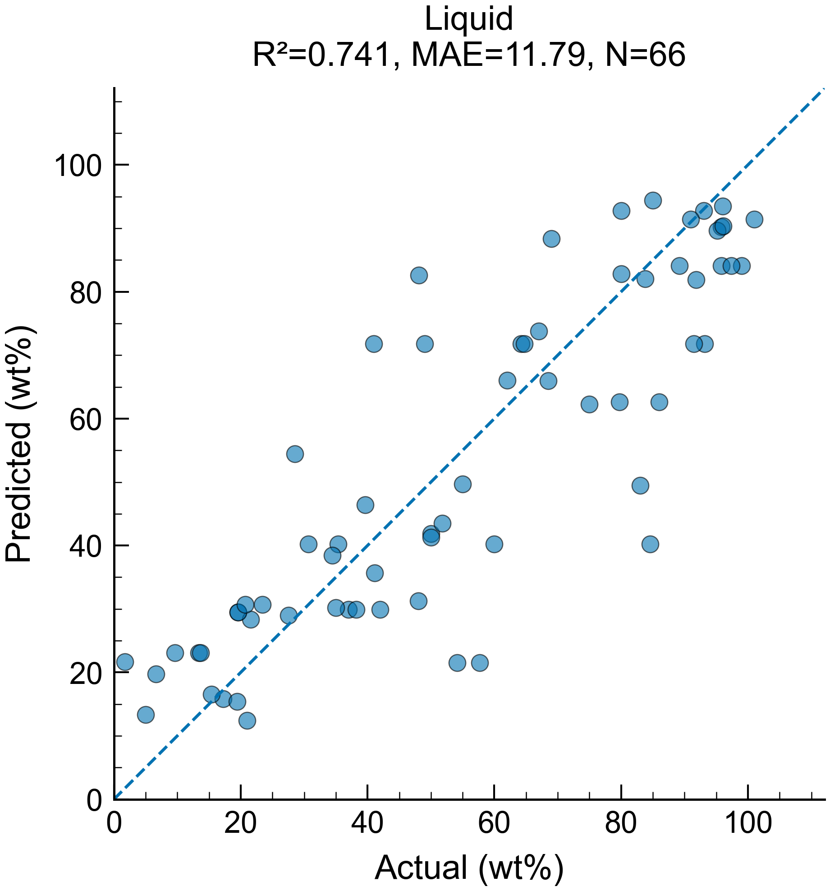

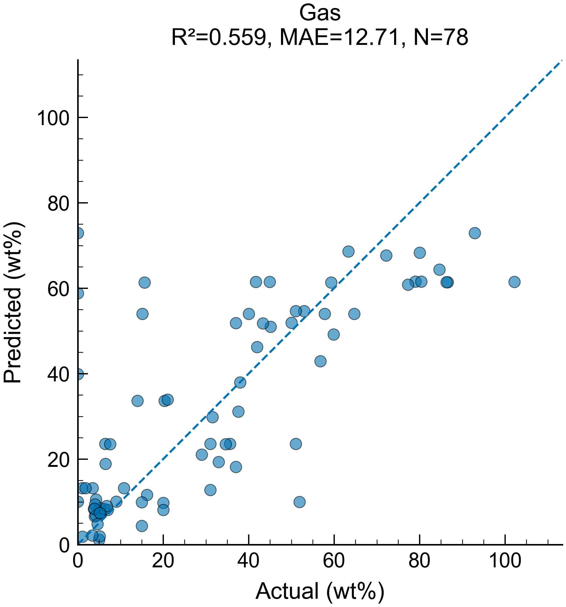

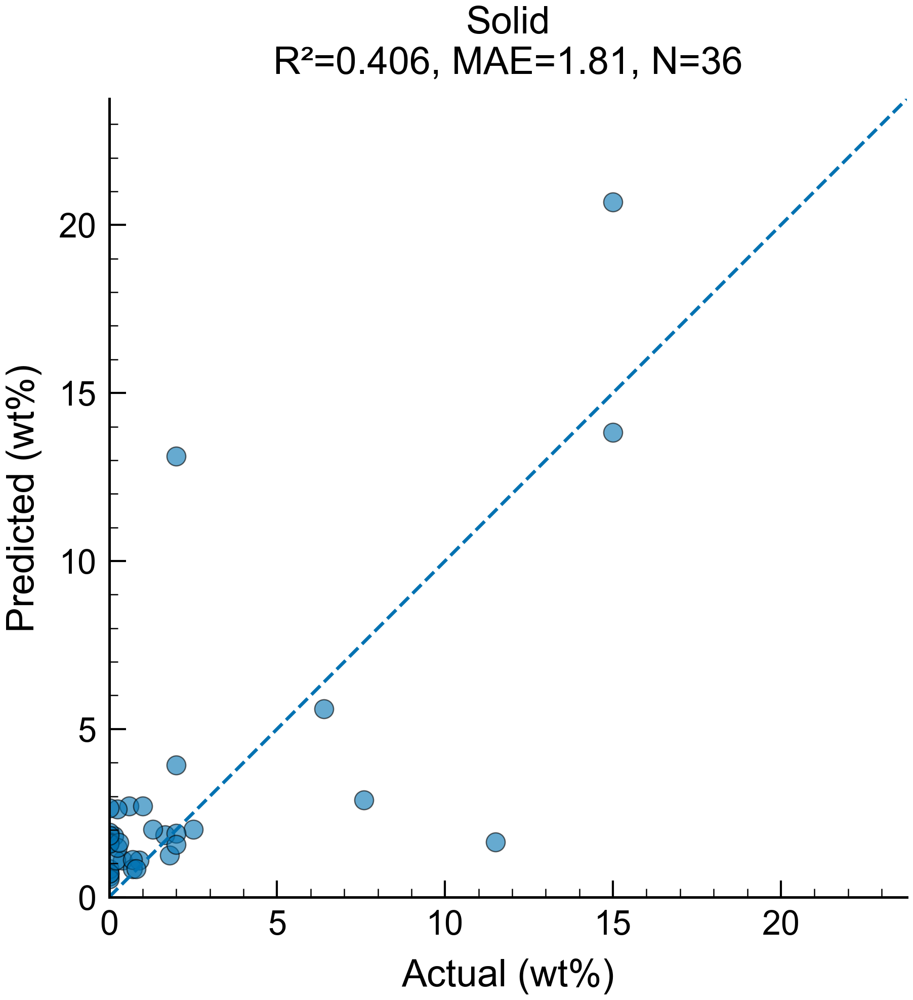

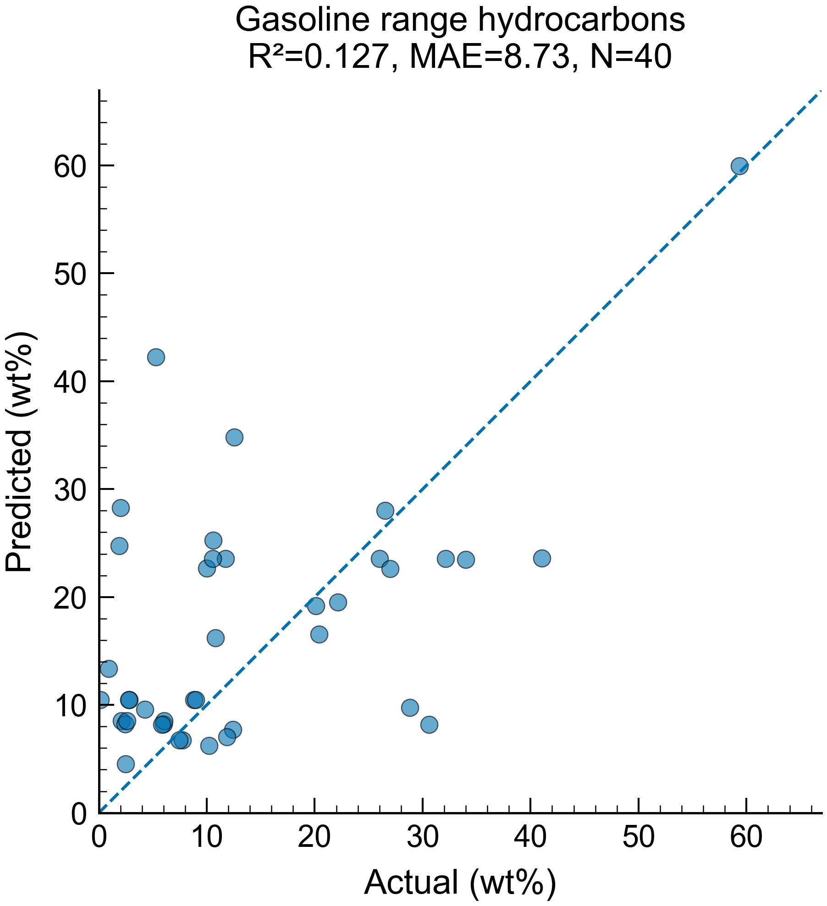

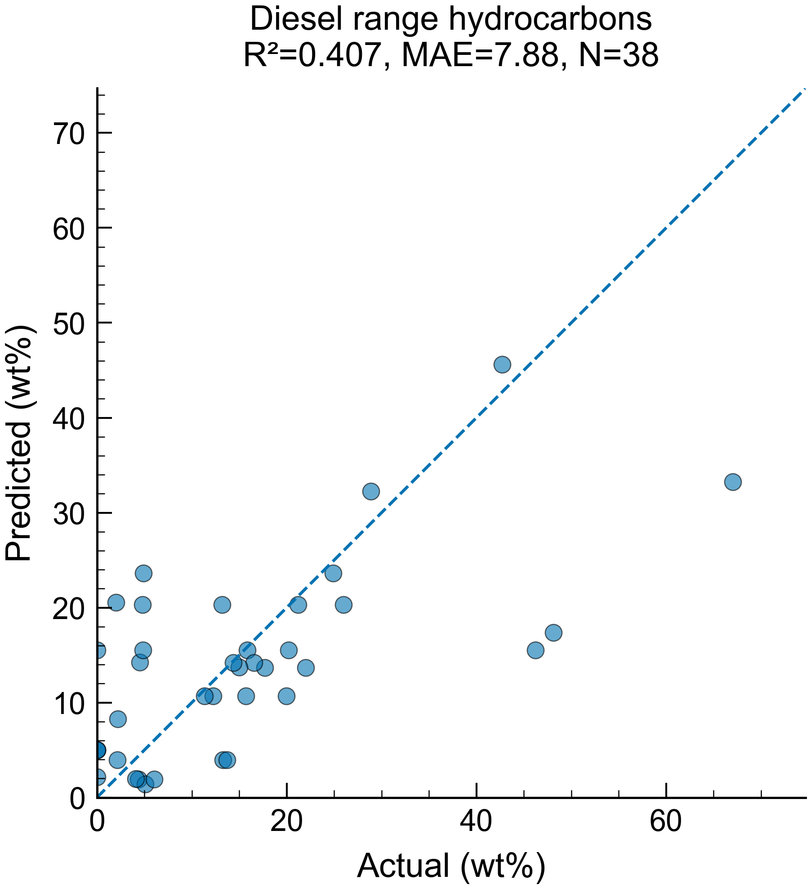

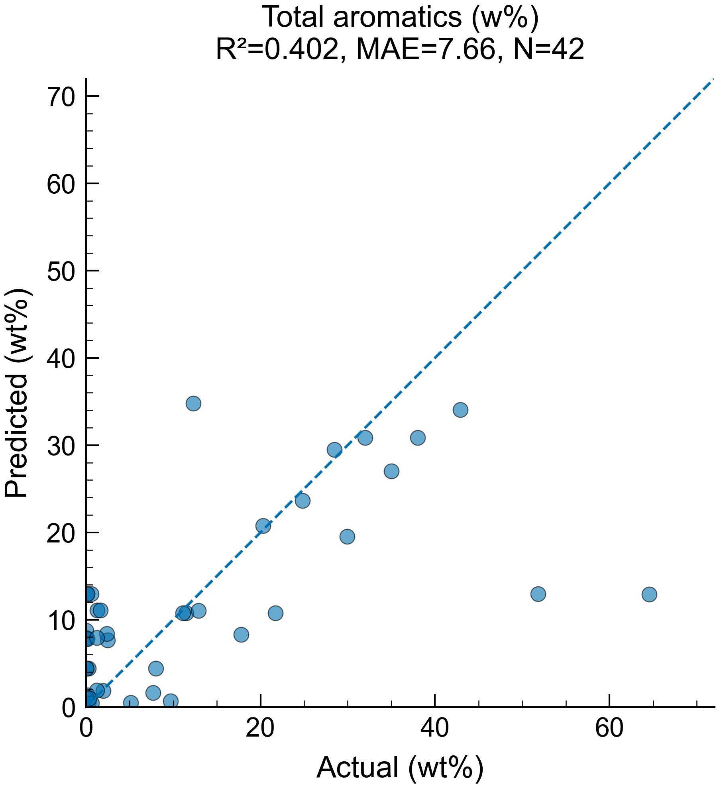

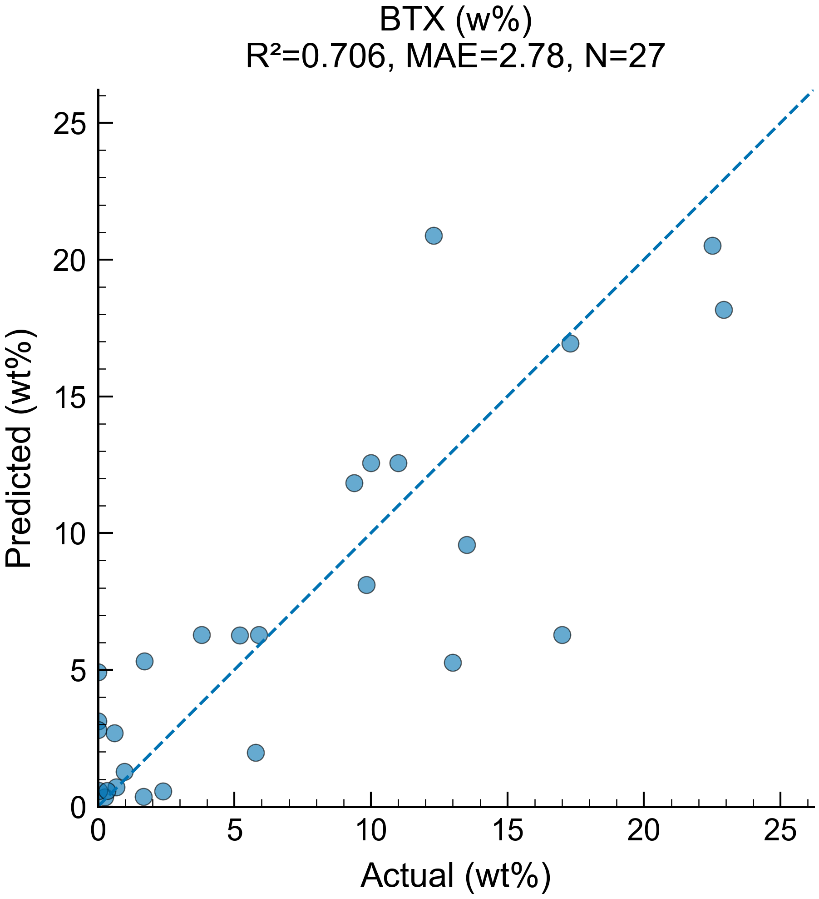

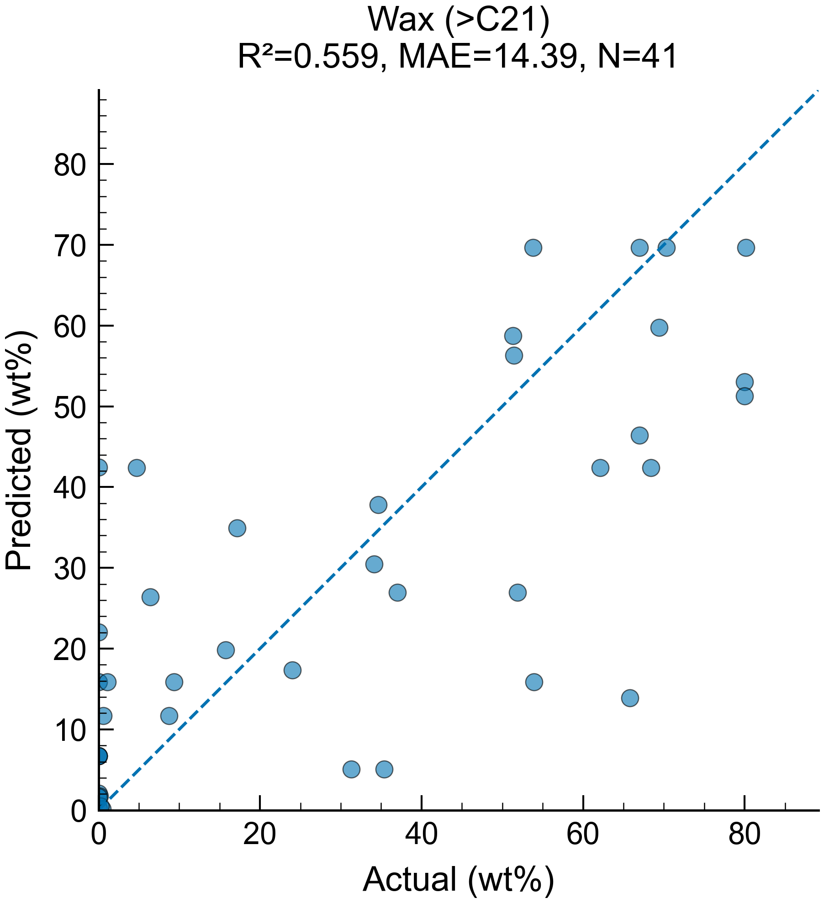

## S2.5 Compound Mapping

The 8 ML output categories are disaggregated into specific BioSTEAM compound IDs using fixed sub-distributions.

**Table S8.** Gas phase compound mapping.

| Compound | BioSTEAM ID | Sub-fraction |
|----------|------------|--------------|
| Hydrogen | H2 | 0.02 |
| Methane | CH4 | 0.20 |
| Ethylene | C2H4 | 0.25 |
| Propane | C3H8 | 0.25 |
| 1-Butene | C4H8 | 0.15 |
| Carbon monoxide | CO | 0.05 |
| Carbon dioxide | CO2 | 0.08 |
| **Total** | | **1.00** |

**Table S9.** Liquid sub-category compound mapping.

| Category | Compound | BioSTEAM ID | Sub-fraction |
|----------|----------|------------|--------------|
| **Gasoline** | n-Octane | C8H18 | 0.35 |
| | n-Decane | C10H22 | 0.35 |
| | n-Heptane | C7H16 | 0.15 |
| | n-Undecane | C11H24 | 0.15 |
| **Diesel** | n-Tetradecane | C14H30 | 0.40 |
| | 1-Hexadecene | C16H32 | 0.35 |
| | n-Eicosane | C20H42 | 0.25 |
| **BTX** | Benzene | C6H6 | 0.30 |
| | Toluene | C7H8 | 0.40 |
| | Ethylbenzene | C8H10 | 0.30 |
| **Other aromatics** | Styrene | C8H8 | 0.40 |
| | Methylstyrene | C9H10 | 0.30 |
| | Naphthalene | C10H8 | 0.30 |
| **Wax** | n-Tetracosane | C24H50 | 0.60 |
| | n-Tetracontane | C40H82 | 0.40 |

### Consistency constraints applied during mapping:
1. If sub-category total (Gasoline + Diesel + Aromatics + Wax) exceeds Liquid, all sub-categories are scaled down proportionally
2. If Liquid exceeds sub-category total, the residual is assigned to Gasoline
3. All compound fractions are normalized to sum to 1.0
4. BTX is capped at Total aromatics

## S2.6 Plasma-Specific Compound Mapping

Plasma pyrolysis uses a distinct compound mapping due to CO2-derived reactive species:

| Category | Compound | BioSTEAM ID | Sub-fraction |
|----------|----------|------------|--------------|
| **Gas** | Carbon monoxide | CO | 0.90 |
| | Hydrogen | H2 | 0.05 |
| | Methane | CH4 | 0.03 |
| | Ethylene | C2H4 | 0.02 |
| **Gasoline** | n-Octane | C8H18 | 1.00 (single surrogate) |
| **Diesel** | n-Octadecane | C18H38 | 1.00 (single surrogate) |
| **Wax** | n-Triacontane | C30H62 | 1.00 (single surrogate) |
| **Oxygenated** | 1-Dodecanol (Alcohol) | Alcohol | 0.722 |
| (residual liquid) | Fatty acid (Acid) | Acid | 0.171 |
| | 2,6-Di-tert-butyl-4-methylphenol | C14H22O | 0.107 |

The "oxygenated" fraction represents the residual liquid (total Liquid minus Gasoline, Diesel, Aromatics, Wax) and accounts for hydrocarbons oxidized by CO2-derived reactive species. The CO2 factor of 1.298 means total product mass is ~130% of feedstock mass.

## S2.7 Reactor-Type Corrections

The base PyrolysisNet model is trained on conventional (thermal, inert) pyrolysis data. Linear additive corrections shift the 8 predicted wt% outputs for different reactor chemistries:

$$\text{corrected}_i(T) = \text{base}_i + \alpha_i + \beta_i \times T$$

where T is the reaction temperature in °C.

### S2.7.1 TOD Correction

Anchored so delta(400 °C) = 0 for all outputs. Measured at 600 °C from Olafasakin et al. (2023), *Energy Fuels*, 37, 15832-15842 (100% HDPE, 93:7 HDPE/O2).

**Table S10.** TOD correction coefficients.

| Output | Intercept (alpha) | Slope (beta, per °C) | Delta at 600 °C |
|--------|-------------------|---------------------|-----------------|
| Liquid | +7.00 | -0.0175 | -3.50 |
| Gas | -16.40 | +0.0410 | +8.20 |
| Solid | -0.54 | +0.00135 | +0.27 |
| Gasoline | -11.00 | +0.0275 | +5.50 |
| Diesel | -5.96 | +0.0149 | +2.98 |
| Aromatics | 0.0 | 0.0 | 0.0 |
| BTX | 0.0 | 0.0 | 0.0 |
| Wax | +24.00 | -0.0600 | -12.00 |

### S2.7.2 Catalytic Correction

Fit to two temperature-bin midpoints (600 °C and 725 °C) derived from aston.xlsx comparison of catalytic (>10 wt% total aromatics, N~70) vs. thermal (<=5 wt%, N~120) polyolefin experiments.

**Table S11.** Catalytic correction coefficients.

| Output | Intercept (alpha) | Slope (beta, per °C) |
|--------|-------------------|---------------------|
| Liquid | +61.7 | -0.1064 |
| Gas | +76.7 | -0.0952 |
| Solid | -36.1 | +0.0512 |
| Gasoline | -13.5 | +0.0128 |
| Diesel | -6.8 | -0.0048 |
| Aromatics | +142.3 | -0.1672 |
| BTX | -8.5 | +0.0264 |
| Wax | -146.0 | +0.1816 |

Post-correction normalization:
1. Phase totals (Gas + Liquid + Solid) renormalized to 100%
2. Sub-categories scaled to fit within Liquid
3. BTX capped at Total aromatics

### S2.7.3 Plasma Correction

Calibrated so that at virtual_temperature = 450 °C with HDPE = 100% the corrected categories reproduce Case G (CO2 plasma, tR = 20 s) from Radhakrishnan et al. (2024).

**Table S12.** Plasma correction coefficients.

| Output | Type | Correction Value | Notes |
|--------|------|-----------------|-------|
| Liquid | Additive | +29.61 | CO2 incorporation -> oxygenated products |
| Gas | Additive | +8.05 | CO-dominated |
| Solid | Additive | -1.61 | Eliminated under plasma conditions |
| Gasoline | Multiplicative | x 0.850 | 13.1 / 15.42 |
| Diesel | Multiplicative | x 0.329 | 11.4 / 34.70 |
| Aromatics | Additive | -2.15 | Suppressed (no catalyst) |
| BTX | Additive | -1.59 | Suppressed |
| Wax | Multiplicative | x 0.058 | 3.1 / 53.23 |

Phase totals are NOT normalized to 100% because CO2 mass incorporation inflates the liquid fraction (total yields ~130%). Sub-categories (Gasoline, Diesel, Wax) use multiplicative scaling to prevent negative values when the ML model predicts different raw distributions for non-HDPE feeds.

## S2.8 Parametric Studies

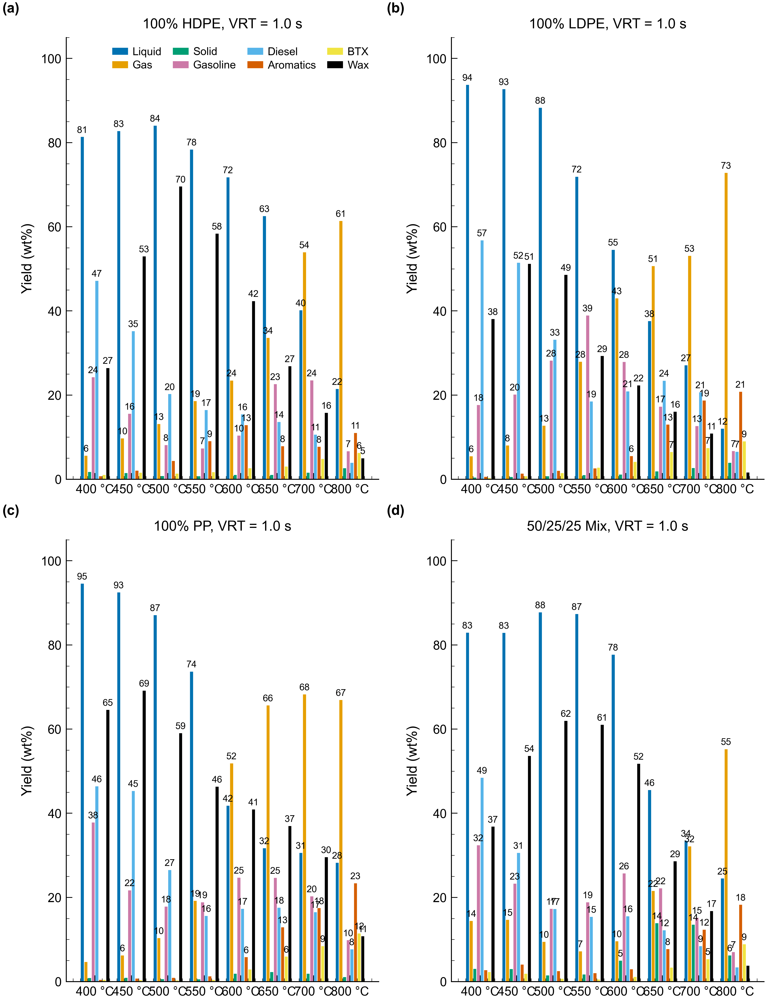

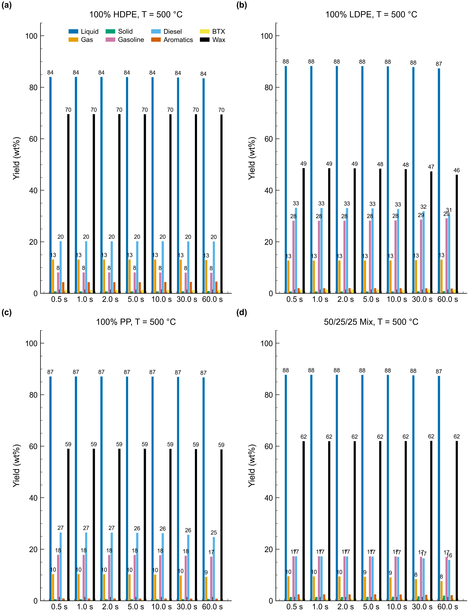

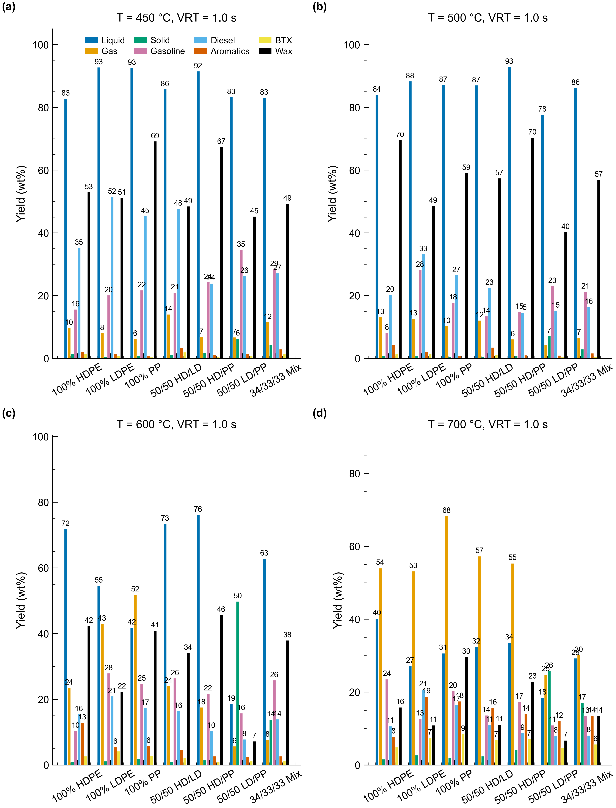

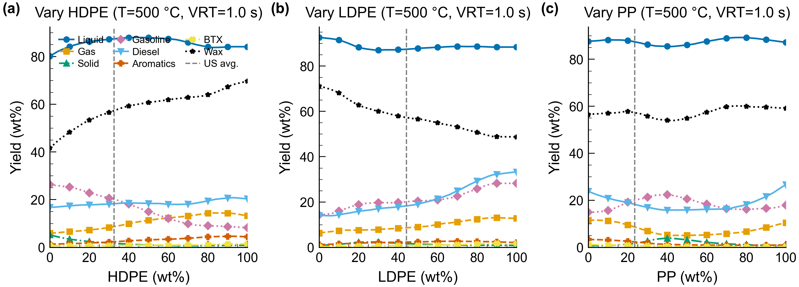

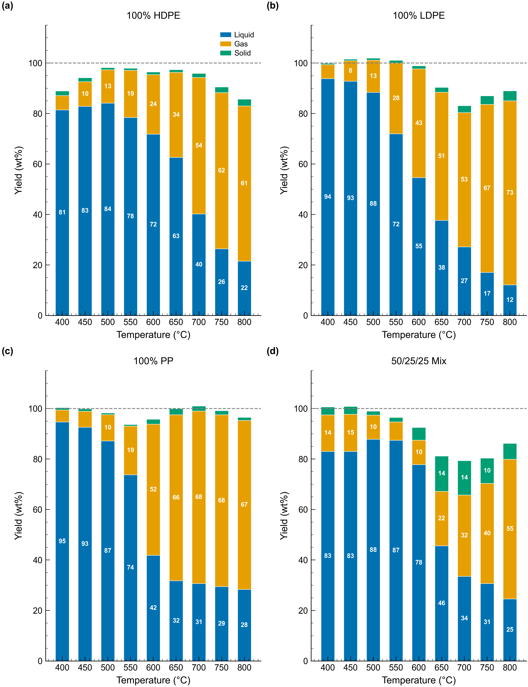

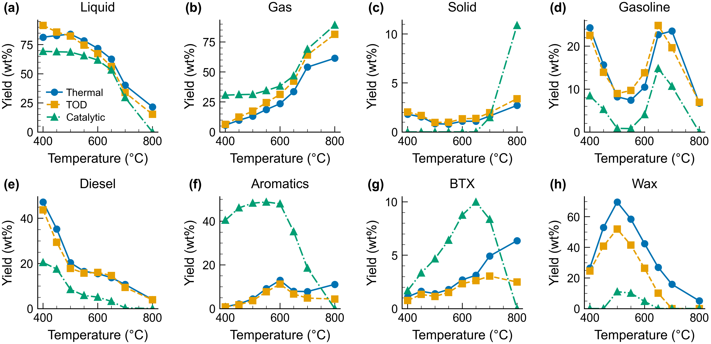


```{=openxml}
<w:p><w:r><w:br w:type="page"/></w:r></w:p>
```

# S3. Techno-Economic Analysis

## S3.1 TEA Framework

The techno-economic analysis uses a discounted cash flow rate of return (DCFROR) methodology implemented in BioSTEAM 2.51.3. The minimum selling price (MSP) of feedstock is calculated as the breakeven feedstock price at which the net present value equals zero at the specified internal rate of return.

## S3.2 Financial Assumptions

**Table S13.** TEA financial parameters.

| Parameter | Value | Notes |
|-----------|-------|-------|
| Internal rate of return (IRR) | 10% | Target return on equity |
| Plant life | 20 years | 2020-2040 |
| Depreciation | MACRS 7-year | Modified Accelerated Cost Recovery System |
| Income tax rate | 21% | US federal corporate rate |
| Operating days | 333 days/year | 91.2% availability |
| Operating hours | 7,992 hr/year | 333 x 24 |
| Lang factor | 5.05 | Total installed cost / purchased equipment cost |
| Construction schedule | 40% / 60% | Year 1 / Year 2 |
| Working capital | 5% of FCI | Working capital over fixed capital investment |
| Debt fraction | 40% | Fraction of capital financed by debt |
| Loan term | 10 years | |
| Loan interest rate | 7% | |
| Startup period | 0 months | No startup ramp assumed |

## S3.3 Capital Cost Methodology

The total installed equipment cost is calculated as:

$$\text{Installed Cost} = \text{Purchased Equipment Cost} \times \text{Lang Factor}$$

Individual equipment costs are scaled from reference sizes using the six-tenths rule:

$$C = C_{\text{ref}} \times \left(\frac{S}{S_{\text{ref}}}\right)^n \times \frac{\text{CE}}{\text{CE}_{\text{ref}}}$$

where C is the estimated cost, S is the capacity, n is the scaling exponent, and CE is the Chemical Engineering Plant Cost Index.

Key equipment cost references:

| Equipment | Reference Cost | Reference Size | Exponent | CE |
|-----------|---------------|----------------|----------|-----|
| Feed handling (conveyor + hopper) | $534,114 | 500 tpd | 0.6 | 596.2 |
| Grinder | $616,711 | 500 tpd | 0.6 | 550.8 |
| Screen | $39,934 | 500 tpd | 0.6 | 550.8 |
| Cyclone | $982,511 | 500 tpd | 0.6 | 567.5 |
| RYield Reactor (TOD) | $8,766,342 | 500 tpd | 0.6 | 567.5 |
| Hydrocracker | $30,000,000 | 2,250 bbl/d | 0.65 | 468.2 |
| Plasma Reactor | $20,000,000 | 200,000 kg/d | 0.7 | - |
| Turbogenerator | $600/kW | variable | 1.0 | - |

## S3.4 Operating Cost Breakdown

**Table S14.** Fixed operating cost factors (fraction of FCI unless noted).

| Cost Category | Factor | Basis |
|---------------|--------|-------|
| Property tax | 0.1% of FCI | |
| Property insurance | 0.5% of FCI | |
| Maintenance | 0.3% of FCI | |
| Administration | 0.5% of FCI | |
| Fringe benefits | 40% of labor cost | Health, retirement, etc. |
| Supplies | 20% of labor cost | Consumables, office |

Fixed operating cost (FOC):

$$\text{FOC} = \text{FCI} \times (\text{property tax} + \text{insurance} + \text{maintenance} + \text{administration}) + \text{labor} \times (1 + \text{fringe} + \text{supplies})$$

## S3.5 Labor Cost

Labor costs are scaled from a 2,000 tpd reference plant (Dutta et al., 2002) to the 250 tpd plant capacity using linear scaling.

**Table S15.** Labor cost breakdown (2,000 tpd reference basis).

| Position | Annual Salary ($) | Number of Staff | Total ($) |
|----------|------------------|----------------|-----------|
| Plant Manager | 159,000 | 1 | 159,000 |
| Plant Engineer | 94,000 | 1 | 94,000 |
| Maintenance Supervisor | 87,000 | 1 | 87,000 |
| Maintenance Technician | 62,000 | 6 | 372,000 |
| Lab Manager | 80,000 | 1 | 80,000 |
| Lab Technician | 58,000 | 1 | 58,000 |
| Shift Supervisor | 80,000 | 3 | 240,000 |
| Shift Operators | 62,000 | 12 | 744,000 |
| Yard Employees | 36,000 | 4 | 144,000 |
| Clerks & Secretaries | 43,000 | 1 | 43,000 |
| General Manager | 188,000 | 0 | 0 |
| **Total (2,000 tpd)** | | **31** | **$2,021,000** |
| **Scaled to 250 tpd** | | | **$252,625** |

Scaling factor: 250 / 2,000 = 0.125.

**Source:** Dutta (2002), adjusted using US Bureau of Labor Statistics data (http://data.bls.gov/cgi-bin/srgate). Staffing numbers from Yadav et al.

## S3.6 MSP Calculation

The minimum selling price (MSP) of feedstock is determined using BioSTEAM's `solve_price()` method, which iterates on the feedstock price until NPV = 0 at the specified IRR (10%).

A negative MSP indicates the plant is profitable at zero feedstock cost and can afford to pay for waste plastic intake (i.e., the plant generates a net revenue even without charging a tipping fee). A positive MSP indicates a tipping fee is required to achieve the target IRR.

## S3.7 Utility Costs

Utility costs are computed from BioSTEAM's built-in utility agent pricing:
- **Electricity:** Medium voltage grid electricity
- **Heating:** High-temperature steam (1000 K), hot water (75 °C)
- **Cooling:** Ammonia refrigerant (0 °C) for sub-ambient cooling
- **Heat transfer price:** $1.32 x 10^-5 per kJ


```{=openxml}
<w:p><w:r><w:br w:type="page"/></w:r></w:p>
```

# S4. Life Cycle Assessment

## S4.1 System Boundary

The LCA follows a cradle-to-gate approach using the ecoinvent 3.x database (Allocation at the Point of Substitution, APOS). The system boundary includes:

- **Inputs:** Feedstock (waste plastic), natural gas, oxygen, CO2, catalysts, electricity, heating/cooling utilities
- **Outputs:** All product streams (fuels, chemicals, organics, hydrogen), flue gas emissions
- **Excluded:** Transportation of feedstock, end-of-life of products, construction/decommissioning of plant

## S4.2 Impact Categories

Ten impact categories from the TRACI 2.1 methodology are evaluated:

| # | Impact Category | Unit |
|---|----------------|------|
| 1 | Global warming (GWP) | kg CO2 eq |
| 2 | Acidification | kg SO2 eq |
| 3 | Eutrophication | kg N eq |
| 4 | Smog | kg O3 eq |
| 5 | Ozone depletion | kg CFC-11 eq |
| 6 | Respiratory effects | kg PM2.5 eq |
| 7 | Ecotoxicity | CTUe |
| 8 | Carcinogenics | CTUh |
| 9 | Non-carcinogenics | CTUh |
| 10 | Fossil fuel depletion | MJ surplus |

GWP is the primary metric for optimization.

## S4.3 Emission Factor Table

**Table S16.** Life cycle emission factors (GWP, kg CO2-eq per unit).

| Resource | ecoinvent Process | GWP (kg CO2-eq/unit) | Unit |
|----------|------------------|---------------------|------|
| Benzene | market for benzene, APOS, U | 1.994 | kg |
| Acetic acid | market for acetoacetic acid, APOS, U | 8.363 | kg |
| Acetaldehyde | market for acetaldehyde, APOS, U | 1.849 | kg |
| Heavy fuel oil | market for heavy fuel oil, APOS, U | 0.348 | kg |
| Lubricating oil | market for lubricating oil, APOS, U | 1.353 | kg |
| Oxygen | market for oxygen, liquid, APOS, U | 1.072 | kg |
| Methanol | market for methanol, APOS, U | 0.629 | kg |
| Butane | market for butane, APOS, U | 0.768 | kg |
| Naphtha | market for naphtha, APOS, U | 0.366 | kg |
| Diesel | market for diesel, APOS, U | 0.475 | kg |
| Ethylene | market for ethylene, average, APOS, U | 1.396 | kg |
| Propylene | market for propylene, APOS, U | 1.435 | kg |
| Wax | market for wax, lost-wax casting, APOS, U | 0.745 | kg |
| Hydrogen | market for hydrogen, liquid, APOS, U | 2.277 | kg |
| Electricity (medium voltage) | market for electricity, medium voltage, APOS, U | 0.456 | MJ |
| Natural gas | market for natural gas, liquefied, APOS, U | 0.574 | m3 |

## S4.4 Stream-to-Resource Mapping

**Table S17.** BioSTEAM stream ID to LCA resource mapping with multipliers.

| Stream ID | LCA Resource | Multiplier | Type |
|-----------|-------------|------------|------|
| comb_nat_gas | Natural gas | +0.8 | Feed (m3 to kg conversion) |
| CPY_residue | Heavy fuel oil | -1.0 | Product credit |
| CPY_AromaticsO | Benzene | -1.0 | Product credit |
| SS_BTX | Benzene | -1.0 | Product credit |
| PLASMA_Carbonyls | Acetaldehyde | -1.0 | Product credit |
| PLASMA_Acids | Acetic acid | -1.0 | Product credit |
| PLASMA_Alcohols | Methanol | -1.0 | Product credit |
| PLASMA_C30 | Lubricating oil | -1.0 | Product credit |
| PLASMA_Olefins | Butane | -1.0 | Product credit |
| PLASMA_Paraffins | Naphtha | -1.0 | Product credit |
| SS_Diesel | Diesel | -1.0 | Product credit |
| SS_Wax | Wax | -1.0 | Product credit |
| SS_Hydrogen | Hydrogen | -1.0 | Product credit |
| SS_Naphtha | Naphtha | -1.0 | Product credit |
| SS_Butene | Butane | -1.0 | Product credit |
| DIST_Ethylene | Ethylene | -1.0 | Product credit |
| DIST_Propylene | Propylene | -1.0 | Product credit |
| DIST_Butene | Butane | -1.0 | Product credit |

**Sign convention:** Negative multiplier = product credit (displaces conventional production); Positive = environmental burden (resource consumed).

## S4.5 GWP Calculation

Total GWP is computed hourly:

$$\text{GWP}_{\text{total}} = \sum_{s \in \text{streams}} F_{s} \times \text{EF}_{s} \times m_{s} + \text{GWP}_{\text{electricity}} + \text{GWP}_{\text{heat}} + \text{GWP}_{\text{FCC offgas}}$$

where:
- $F_s$ = mass flow rate of stream $s$ (kg/hr)
- $\text{EF}_s$ = emission factor of mapped resource (kg CO2-eq/kg)
- $m_s$ = multiplier (positive for burdens, negative for credits)

**Electricity GWP:**

$$\text{GWP}_{\text{elec}} = P_{\text{consumption}} \times 3.6 \times \text{EF}_{\text{electricity}}$$

where $P_{\text{consumption}}$ is net power consumption in kW and 3.6 converts kWh to MJ.

**Heat GWP:**

$$\text{GWP}_{\text{heat}} = Q_{\text{net cooling}} \times \text{EF}_{\text{natural gas}} / 1000 / 3600$$

where $Q_{\text{net cooling}}$ is the sum of negative (cooling) heat duties in kJ/hr.

**FCC off-gas direct emissions:**

$$\text{GWP}_{\text{FCC}} = \dot{m}_{\text{CO2}} + 32 \times \dot{m}_{\text{CH4}}$$

The factor of 32 represents the 100-year GWP of methane relative to CO2.

**Normalization:** GWP per kg feed = GWP_total (kg CO2-eq/hr) / feed mass flow (kg/hr).

## S4.6 Carbon Abatement Cost

The carbon abatement cost (CAC) quantifies the economic cost of avoiding one kg of CO2-equivalent emissions:

$$\text{CAC} = \frac{\text{Net cost per kg feed}}{-\text{GWP per kg feed}}$$

where:
- Net cost per kg feed = (Annual operating cost - Annual sales) / Annual feed mass
- Negative GWP per kg feed represents CO2-eq reduced (positive when GWP is negative)

A negative CAC indicates that the process both reduces emissions and generates net revenue (win-win). A positive CAC indicates the cost per kg CO2-eq avoided.

## S4.7 Product Credit Methodology

Product credits follow the displacement approach: each product stream displaces an equivalent amount of conventional (fossil-derived) production. The environmental burden of conventional production is subtracted from the process GWP, yielding a net negative GWP when product credits exceed process burdens.


```{=openxml}
<w:p><w:r><w:br w:type="page"/></w:r></w:p>
```

# S5. Product Price Scenarios

## S5.1 Price Data

All prices are in $/kg, based on US Gulf Coast / North American market data from 2015-2025.

**Table S18.** Product prices by regime ($/kg).

| Product | Group | Low | Baseline | High | Sources |
|---------|-------|-----|----------|------|---------|
| Naphtha | Fuel | 0.25 | 0.55 | 0.80 | [1] |
| Diesel | Fuel | 0.27 | 0.70 | 1.00 | [2], [18] |
| Wax | Fuel | 0.70 | 1.00 | 1.50 | [3] |
| Ethylene | Chemical | 0.30 | 1.10 | 1.30 | [4] |
| Propylene | Chemical | 0.42 | 1.00 | 1.50 | [5], [6] |
| Butene | Chemical | 0.85 | 0.80 | 1.30 | [7] |
| BTX | Chemical | 0.50 | 0.90 | 1.10 | [8] |
| Aromatics | Chemical | 0.30 | 0.85 | 1.10 | [9] |
| Paraffins | Organic | 0.80 | 0.60 | 1.50 | [10] |
| Carbonyls | Organic | 0.50 | 0.50 | 2.40 | [11], [12] |
| Olefins | Organic | 0.90 | 0.85 | 2.00 | [13] |
| Alcohols | Organic | 0.35 | 0.50 | 0.69 | [14] |
| Acids | Organic | 0.45 | 0.35 | 1.90 | [15] |
| C30 | Organic | 0.45 | 0.25 | 1.00 | [17] |
| Hydrogen | Hydrogen | 1.00 | 2.50 | 2.50 | [16] |

**Price regime definitions:**
- **Low:** 2020 COVID demand destruction or 2015-2016 oil price collapse (WTI < $30/bbl)
- **Baseline:** Approximately the 2018-2019 pre-pandemic average
- **High:** 2021 Texas Winter Storm Uri (Feb freeze) or Q1-Q2 2022 post-COVID surge + Russia-Ukraine energy crisis

## S5.2 Scenario Definitions

**Table S19.** Price scenario construction.

| Scenario | Description | Construction Rule |
|----------|-------------|-------------------|
| **baseline** | Mid-range prices for all products | All products use baseline price |
| **high_fuel** | High fuel prices, low chemical/organics | Fuels (Naphtha, Diesel, Wax) use HIGH; all others use LOW |
| **high_chem** | High chemical prices, low fuel/organics | Chemicals (Ethylene, Propylene, Butene, BTX, Aromatics) use HIGH; all others use LOW |
| **high_organics** | High specialty organic prices, low fuel/chem | Organics (Paraffins, Carbonyls, Olefins, Alcohols, Acids, C30) use HIGH; all others use LOW |

The scenario structure tests the sensitivity of optimal superstructure configuration to different market conditions. Each non-baseline scenario maximizes prices for one product group while minimizing all others, representing extreme market conditions.

### Detailed Scenario Prices ($/kg)

| Product | baseline | high_fuel | high_chem | high_organics |
|---------|----------|-----------|-----------|---------------|
| Naphtha | 0.55 | **0.80** | 0.25 | 0.25 |
| Diesel | 0.70 | **1.00** | 0.27 | 0.27 |
| Wax | 1.00 | **1.50** | 0.70 | 0.70 |
| Ethylene | 1.10 | 0.30 | **1.30** | 0.30 |
| Propylene | 1.00 | 0.42 | **1.50** | 0.42 |
| Butene | 0.80 | 0.85 | **1.30** | 0.85 |
| BTX | 0.90 | 0.50 | **1.10** | 0.50 |
| Aromatics | 0.85 | 0.30 | **1.10** | 0.30 |
| Paraffins | 0.60 | 0.80 | 0.80 | **1.50** |
| Carbonyls | 0.50 | 0.50 | 0.50 | **2.40** |
| Olefins | 0.85 | 0.90 | 0.90 | **2.00** |
| Alcohols | 0.50 | 0.35 | 0.35 | **0.69** |
| Acids | 0.35 | 0.45 | 0.45 | **1.90** |
| C30 | 0.25 | 0.45 | 0.45 | **1.00** |
| Hydrogen | 2.50 | 1.00 | 1.00 | 1.00 |

Bold values indicate the HIGH price used in each scenario.

## S5.3 Product Groupings

| Group | Products |
|-------|----------|
| **Fuels** | Naphtha, Diesel, Wax |
| **Chemicals** | Ethylene, Propylene, Butene, BTX, Aromatics |
| **Organics** | Paraffins, Carbonyls, Olefins, Alcohols, Acids, C30 |
| **Hydrogen** | Hydrogen |

## S5.4 Sources

[1] Statista - Global naphtha price forecast & historical. https://www.statista.com/statistics/1171139/price-naphtha-forecast-globally/

[2] EIA - US No. 2 Diesel Wholesale/Resale Price. https://www.eia.gov/dnav/pet/hist/LeafHandler.ashx?n=PET&s=EMA_EPD2D_PWG_NUS_DPG&f=M

[3] ChemAnalyst - Paraffin Wax Pricing (North America, 2020-2025). https://www.chemanalyst.com/Pricing-data/paraffin-wax-1205

[4] Statista - Global ethylene price forecast & historical. https://www.statista.com/statistics/1170573/price-ethylene-forecast-globally/

[5] OPIS/S&P Global - US ethylene and propylene spot prices (2020-2022). https://blog.opisnet.com/ethylene-propylene-prices-2020

[6] Statista - Global propylene monthly price. https://www.statista.com/statistics/1318104/monthly-price-propylene-worldwide/

[7] ChemAnalyst - Linear Alpha Olefin Pricing (1-Butene, US). https://www.chemanalyst.com/Pricing-data/linear-alpha-olefin-1103

[8] Statista - Global benzene price (proxy for BTX). https://www.statista.com/statistics/1171072/price-benzene-forecast-globally/

[9] ChemAnalyst - Mixed Xylene Pricing (toluene/xylene, US). https://www.chemanalyst.com/Pricing-data/mixed-xylene-80

[10] ChemAnalyst - Liquid Paraffin Pricing (n-paraffins, North America). https://www.chemanalyst.com/Pricing-data/liquid-paraffin-1197

[11] S&P Global - US acetone record highs (Mar 2021, proxy for carbonyls). https://www.spglobal.com/commodityinsights/en/market-insights/latest-news/chemicals/030421

[12] IMARC Group - MEK Pricing Report (methyl ethyl ketone, 2020-2024). https://www.imarcgroup.com/methyl-ethyl-ketone-pricing-report

[13] ChemAnalyst - Linear Alpha Olefin Pricing (C6-C18 LAO, US). https://www.chemanalyst.com/Pricing-data/linear-alpha-olefin-1103

[14] Methanex - Regional Methanol Pricing (US Gulf Coast). https://www.methanex.com/our-products/about-methanol/pricing/

[15] ChemAnalyst - Acetic Acid Pricing (US, 2020-2024). https://www.chemanalyst.com/Pricing-data/acetic-acid-9

[16] BlackRidge Research - Gray hydrogen production costs. https://www.blackridgeresearch.com/blog/what-is-grey-hydrogen-h2-definition

[17] Argus Media - Global Waxes (slack wax / C30+ heavy fractions). https://www.argusmedia.com/en/solutions/products/argus-global-waxes

[18] MacroTrends - US diesel fuel historical prices. https://www.macrotrends.net/4394/us-diesel-fuel-prices


```{=openxml}
<w:p><w:r><w:br w:type="page"/></w:r></w:p>
```

# S6. Optimization Results

## S6.1 Optimization Methodology

Multi-objective optimization is performed using scipy's Nelder-Mead simplex method with the following configuration:

| Parameter | Value |
|-----------|-------|
| Algorithm | Nelder-Mead (scipy.optimize.minimize) |
| Variables | 4 split fractions |
| Bounds | [0.05, 0.95] for each variable |
| Initial point | [0.34, 0.50, 0.50, 0.50] |
| Max iterations | 50 |
| x tolerance | 0.01 |
| f tolerance | 0.001 |
| Adaptive | True |

## S6.2 Objective Function

The weighted-sum multi-objective function combines MSP and GWP:

$$\text{score} = w_{\text{MSP}} \times \frac{\text{MSP}}{\text{MSP}_{\text{ref}}} + w_{\text{GWP}} \times \frac{-\text{GWP}}{\text{GWP}_{\text{ref}}}$$

| Weight | Value |
|--------|-------|
| w_MSP | 0.50 |
| w_GWP | 0.50 |

Reference values (MSP_ref, GWP_ref) are computed at the initial point for each scenario to normalize the two objectives to comparable scales. Negative GWP is negated so that both terms are maximized (more negative MSP = better economics; more negative GWP = better environment).

## S6.3 Optimization Variables

| Variable | Symbol | Description | Bounds |
|----------|--------|-------------|--------|
| split_TOD | x1 | Fraction of total feed to CP+TOD (rest to CPY+PLASMA) | 0.05-0.95 |
| split_CP | x2 | Fraction of CP+TOD stream to TOD (rest to CP) | 0.05-0.95 |
| split_CPY | x3 | Fraction of remaining feed to CPY (rest to PLASMA) | 0.05-0.95 |
| split_HC | x4 | Fraction of wax to HC (rest to FCC) | 0.05-0.95 |

## S6.4 Optimal Split Fractions

**Table S20.** Optimal split fractions by scenario.

| Split | baseline | high_fuel | high_chem | high_organics |
|-------|----------|-----------|-----------|---------------|
| CP+TOD vs rest (x1) | 0.342 | 0.342 | 0.328 | 0.163 |
| TOD vs CP (x2) | 0.506 | 0.509 | 0.510 | 0.779 |
| CPY vs PLASMA (x3) | 0.492 | 0.469 | 0.482 | 0.050 |
| HC vs FCC (x4) | 0.526 | 0.518 | 0.541 | 0.791 |

**Key observations:**
- **baseline, high_fuel, high_chem** converge to similar splits (~34% to CP+TOD, ~50/50 TOD/CP, ~50/50 CPY/PLASMA, ~52% to HC)
- **high_organics** shifts dramatically: only 16.3% to CP+TOD, 77.9% to TOD (within that fraction), 95% to PLASMA (vs CPY), and 79.1% to HC. This maximizes PLASMA pathway throughput for high-value organics.

## S6.5 TEA Results

**Table S21.** TEA results by scenario.

| Metric | baseline | high_fuel | high_chem | high_organics |
|--------|----------|-----------|-----------|---------------|
| MSP ($/kg feed) | -0.5244 | -0.4955 | -0.6474 | +0.0093 |
| Utility cost ($/yr) | - | - | $1,887,710 | $5,191,586 |
| Annual sales ($/yr) | - | - | $37,895,920 | $104,971,038 |
| Installed cost ($) | - | - | $221,692,625 | $272,118,239 |

**MSP interpretation:**
- **Negative MSP** (baseline, high_fuel, high_chem): The plant is profitable at zero feedstock cost. Product revenues exceed all operating and capital costs at the 10% IRR target. The plant can afford to *pay* for waste plastic intake.
- **Positive MSP** (high_organics: $0.0093/kg): Despite the highest total sales ($105M/yr), the high_organics scenario requires a small tipping fee because non-favored products (fuels, chemicals) are priced at their LOW values, and the larger PLASMA pathway has higher capital and utility costs ($5.2M/yr utilities, $272M installed).

## S6.6 LCA Results

**Table S22.** LCA results by scenario.

| Metric | baseline | high_fuel | high_chem | high_organics |
|--------|----------|-----------|-----------|---------------|
| GWP (kg CO2-eq/kg feed) | -0.3147 | -0.3275 | -0.3302 | -0.8760 |
| Carbon abatement cost ($/kg CO2-eq) | 0.66 | 0.53 | 0.99 | -0.46 |

**GWP interpretation:**
- All scenarios achieve net-negative GWP, indicating that product displacement credits exceed process emissions.
- **high_organics** has the most negative GWP (-0.876 kg CO2-eq/kg feed) because PLASMA products (alcohols, acids, carbonyls) displace more emission-intensive conventional production.
- **high_organics** also has a negative CAC (-$0.46/kg CO2-eq), meaning CO2 reduction is achieved while generating net revenue.

## S6.7 Sales by Product Group

**Table S23.** Annual sales by product group ($/yr).

| Group | baseline | high_fuel | high_chem | high_organics |
|-------|----------|-----------|-----------|---------------|
| Fuels | $18.68M | $27.37M | $10.16M | $6.16M |
| Chemicals | $5.96M | $2.91M | $7.41M | $0.54M |
| Organics | $16.57M | $16.26M | $16.19M | $92.49M |
| Hydrogen | $4.12M | $1.65M | $1.65M | $1.65M |
| **Total** | **$45.33M** | **$48.19M** | **$35.42M** | **$100.85M** |

**Key observations:**
- Organics dominate in high_organics ($92.5M, 91.7% of total), reflecting the optimizer's shift toward PLASMA
- Fuels dominate in high_fuel ($27.4M, 56.8% of total)
- Baseline is well-diversified (Fuels 41%, Organics 37%, Chemicals 13%, Hydrogen 9%)
- High_chem has the lowest total sales ($35.4M) despite favorable chemical prices, because chemicals represent a small mass fraction of total products

## S6.8 Organics Revenue Breakdown

**Table S24.** Organics revenue breakdown by product ($/yr).

| Product | baseline | high_fuel | high_chem | high_organics |
|---------|----------|-----------|-----------|---------------|
| Acids | $0.51M | $0.67M | $0.67M | $6.32M |
| Alcohols | $6.94M | $5.07M | $5.05M | $22.72M |
| C30 | $0.01M | $0.03M | $0.02M | $0.11M |
| Carbonyls | $2.00M | $2.08M | $2.08M | $22.84M |
| Olefins | $5.31M | $5.88M | $5.85M | $29.69M |
| Paraffins | $1.81M | $2.54M | $2.53M | $10.81M |
| **Total** | **$16.57M** | **$16.26M** | **$16.19M** | **$92.49M** |

**Key observations:**
- In high_organics, Olefins ($29.7M) and Carbonyls ($22.8M) are the top revenue streams, driven by their high prices ($2.00/kg and $2.40/kg respectively)
- Alcohols contribute significantly across all scenarios due to their large mass fraction in PLASMA output
- C30 contributes negligibly (<$0.11M) due to very low production volume
- Non-high_organics scenarios show similar organic revenues (~$16M), indicating organic production is relatively stable across split configurations

## S6.9 Cross-Scenario Analysis

The optimization reveals three distinct regimes:

1. **Balanced operation** (baseline, high_fuel, high_chem): ~34% to CP+TOD, balanced CPY/PLASMA, balanced HC/FCC. The superstructure distributes feed to capture value across all product groups.

2. **PLASMA-dominant** (high_organics): 83.7% to CPY+PLASMA, with 95% of that going to PLASMA. Only 16.3% goes to the CP+TOD pathway, and within that, 77.9% goes to TOD (which produces more wax for HC upgrading at 79.1% HC split).

3. **Price sensitivity**: The optimal configuration is relatively robust to fuel/chemical price changes but highly sensitive to organic prices, which can shift the entire superstructure toward PLASMA dominance.


```{=openxml}
<w:p><w:r><w:br w:type="page"/></w:r></w:p>
```

# S7. Sensitivity & Contour Analysis

## S7.1 Methodology

Contour plots are generated by sweeping pairs of optimization variables across a 12 x 12 grid while holding the remaining two variables at their optimized values. For each of the 6 pairwise combinations of 4 variables, three objective surfaces are mapped:

1. **MSP** ($/kg feed) - Minimum selling price
2. **GWP** (kg CO2-eq/kg feed) - Global warming potential
3. **CAC** ($/kg CO2-eq) - Carbon abatement cost

This produces 18 contour subplots (6 pairs x 3 objectives), arranged in the composite figure.

## S7.2 Variable Pairs

The 6 pairwise combinations of the 4 optimization variables are:

| Pair | X-axis | Y-axis | Fixed Variables |
|------|--------|--------|----------------|
| 1 | split_TOD (CP+TOD vs rest) | split_CP (TOD vs CP) | split_CPY, split_HC at optimal |
| 2 | split_TOD (CP+TOD vs rest) | split_CPY (CPY vs PLASMA) | split_CP, split_HC at optimal |
| 3 | split_TOD (CP+TOD vs rest) | split_HC (HC vs FCC) | split_CP, split_CPY at optimal |
| 4 | split_CP (TOD vs CP) | split_CPY (CPY vs PLASMA) | split_TOD, split_HC at optimal |
| 5 | split_CP (TOD vs CP) | split_HC (HC vs FCC) | split_TOD, split_CPY at optimal |
| 6 | split_CPY (CPY vs PLASMA) | split_HC (HC vs FCC) | split_TOD, split_CP at optimal |

Each axis sweeps from 0.05 to 0.95, yielding 144 evaluations per pair (12 x 12 grid), or 864 total system evaluations per scenario.

## S7.3 Contour Plots


The contour plots reveal:

### S7.3.1 MSP Sensitivity

- **split_TOD** (feed allocation to CP+TOD) has moderate influence on MSP. Lower values (more feed to CPY+PLASMA) generally improve MSP due to higher-value organic products.
- **split_CP** (TOD vs CP allocation) has weak influence on MSP, suggesting TOD and CP have similar economic performance.
- **split_CPY** (CPY vs PLASMA allocation) has strong influence: more PLASMA (lower split_CPY) improves MSP when organic prices are favorable.
- **split_HC** (HC vs FCC wax upgrading) has moderate influence, with HC slightly preferred for economic performance.

### S7.3.2 GWP Sensitivity

- **split_CPY** is the dominant variable: lower values (more PLASMA) yield more negative GWP because PLASMA products displace higher-emission conventional chemicals.
- **split_TOD** shows moderate GWP sensitivity: more CPY+PLASMA feed reduces GWP.
- **split_HC** has weak GWP influence: HC and FCC have similar environmental profiles.
- **split_CP** has minimal GWP effect within the CP+TOD sub-allocation.

### S7.3.3 CAC Sensitivity

- CAC contours reflect the ratio of MSP to GWP sensitivities.
- Regions with strongly negative GWP and near-zero MSP yield the most favorable (negative) CAC values.
- The high_organics optimal point lies in a region of negative CAC, indicating simultaneous economic and environmental benefits.

## S7.4 Key Insights

1. **PLASMA throughput is the primary lever** for both economic and environmental optimization when organic prices are high. The CPY vs PLASMA split is the most influential single variable.

2. **TOD vs CP choice is secondary**: Both thermal pyrolysis technologies produce similar fuel-range products with comparable economics and GWP. The optimizer splits roughly 50/50 except under extreme organic pricing.

3. **HC vs FCC wax upgrading shows mild preference for HC**, consistent with the moderate hydrogen cost and higher diesel/naphtha selectivity of hydrocracking.

4. **Flat objective landscapes** around the baseline optimum (split_TOD ~0.34, split_CP ~0.50, split_CPY ~0.49, split_HC ~0.53) suggest operational flexibility: small deviations from the optimum have minimal impact on MSP or GWP.

5. **Non-convex regions** appear at extreme split values (>0.90 or <0.10) where one pathway receives negligible feed, potentially causing numerical instabilities in column separations and turbogenerator sizing.
