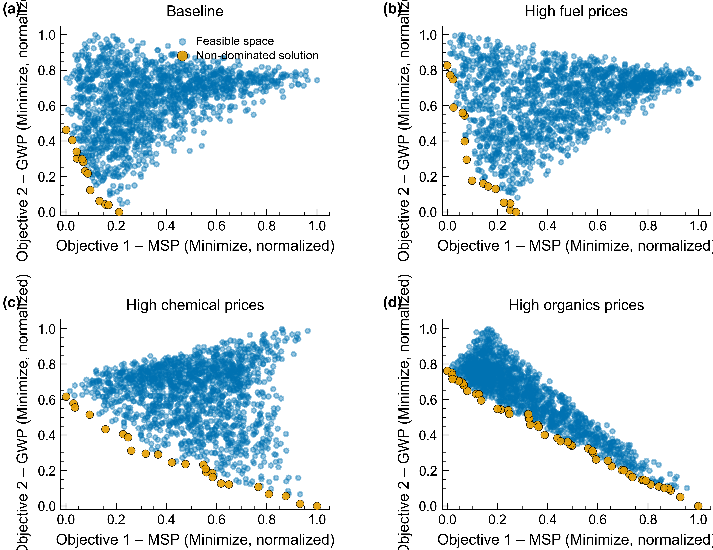
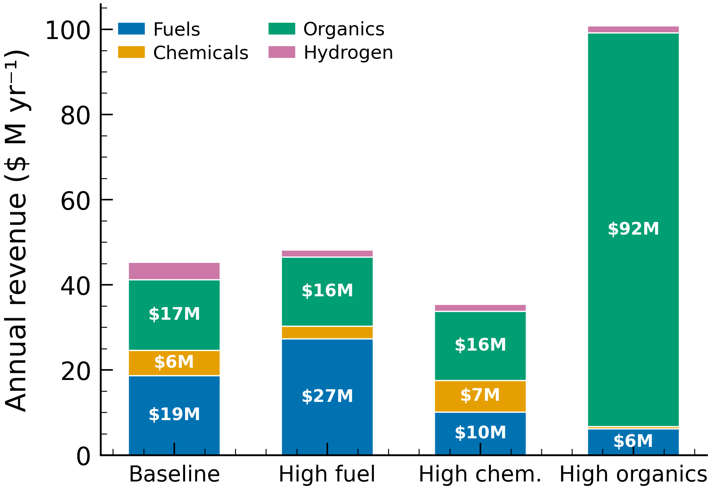
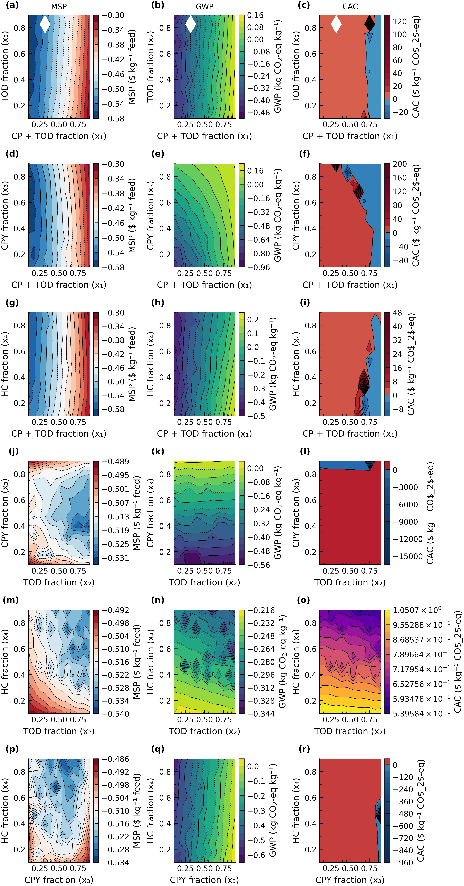
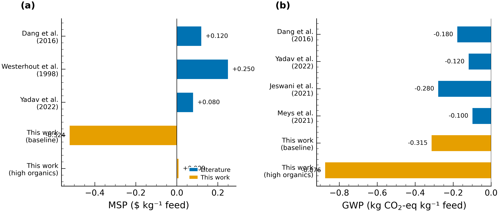

# Results and Discussion

## 3.1 Machine-Learning Model Validation

Accurate yield prediction is essential for a simulation-driven superstructure
optimization.  We trained a feedforward neural network (PyrolysisNet;
5 → 64 → 128 → 64 → 8 architecture with batch normalization and 10 %
dropout) on 566 literature pyrolysis experiments spanning polyethylene,
polypropylene, and polystyrene feedstocks at 300–800 °C and 0.5–120 s vapor
residence time.

The model predicts eight product-category yields (Liquid, Gas, Solid,
Gasoline-range, Diesel-range, Total aromatics, BTX, and Wax >C21) from five
inputs (HDPE, LDPE, PP weight fractions, temperature, and vapor residence
time).  Test-set parity plots (**Figure 1**) confirm that PyrolysisNet captures
the dominant variance for the categories most relevant to techno-economic
analysis: Liquid (R² = 0.74, MAE = 11.8 wt %), BTX (R² = 0.71, MAE = 2.8
wt %), Gas (R² = 0.56), and Wax (R² = 0.56).  Diesel-range (R² = 0.41) and
Total aromatics (R² = 0.40) are moderately well predicted, while Solid
(R² = 0.41) and Gasoline-range hydrocarbons (R² = 0.13) show greater
scatter — consistent with the inherently noisy Gasoline-range measurements in
the underlying literature.

Linear reactor-type corrections, calibrated against published experimental
data for thermal oxodegradation, zeolite-catalyzed pyrolysis, and CO₂-plasma
pyrolysis, extend the base model to each upstream
technology (corrected_*i*(T) = base_*i* + α_*i* + β_*i* × T).
Temperature and composition sweeps reproduce physically expected
trends: liquid yield rises then plateaus above ~500 °C while gas yield
increases monotonically, and LDPE-rich feeds favor liquid over gas relative
to HDPE-rich blends.

**Figure 1.** PyrolysisNet parity plots (predicted vs. experimental, test
set) for the eight product-category yields: **(a)** Liquid, **(b)** Gas,
**(c)** Solid, **(d)** Gasoline-range, **(e)** Diesel-range, **(f)** Total
aromatics, **(g)** BTX, **(h)** Wax >C21.  Dashed lines denote 1:1 parity.

---

## 3.2 Baseline Process Performance

We first evaluated the superstructure at a balanced starting configuration
(x₁ = 0.34, x₂ = 0.50, x₃ = 0.50, x₄ = 0.50) with baseline product
prices.  At a feed rate of 250 tonnes per day of US-average municipal
solid-waste plastic (HDPE 22.0 / LDPE 44.2 / PP 23.4 / PS 10.4 wt % of the
pyrolysis-eligible fraction), the four upstream pathways — thermal
oxodegradation (TOD), conventional pyrolysis (CP), catalytic pyrolysis (CPY),
and plasma pyrolysis (PLASMA) — merge through shared downstream distillation,
hydrocracking (HC), and fluid catalytic cracking (FCC) to produce naphtha,
diesel, wax, ethylene, propylene, butene, BTX, hydrogen, and oxygenated
organics (alcohols, acids, carbonyls, olefins, paraffins).

**Table 1.** Baseline techno-economic and environmental performance
(250 tpd, balanced splits, baseline prices).

| Metric | Value |
|--------|-------|
| Minimum selling price (MSP) | −$0.524 kg⁻¹ feed |
| Annual product sales | $45.3 M yr⁻¹ |
| Global warming potential (GWP) | −0.315 kg CO₂-eq kg⁻¹ feed |
| Carbon abatement cost (CAC) | $0.66 kg⁻¹ CO₂-eq |

The negative MSP indicates that product revenues — dominated by fuels (41 %),
organics (37 %), chemicals (13 %), and hydrogen (9 %) — exceed all operating
and capital costs at a 10 % internal rate of return over a 20-year plant
life.  Put differently, the plant can afford to *pay* for waste-plastic
intake rather than charge a tipping fee, an outcome that is unique among
published single-technology pyrolysis assessments.

The negative GWP (−0.315 kg CO₂-eq kg⁻¹ feed) reflects the displacement
methodology: product credits from displacing fossil-derived naphtha
(0.366 kg CO₂-eq kg⁻¹), diesel (0.475), ethylene (1.396), propylene (1.435),
and hydrogen (2.277) exceed the process burdens from grid electricity,
natural gas, and FCC off-gas emissions.

---

## 3.3 Multi-Objective Optimization — Pareto Frontiers

We performed a weighted-sum multi-objective optimization (w_MSP = w_GWP = 0.5)
over the four continuous split fractions using Nelder-Mead simplex
(50 iterations, x-tolerance 0.01, adaptive step sizing).  The Pareto frontier
for the baseline price scenario (**Figure 2**) reveals a tight cluster of
near-optimal solutions rather than a broad trade-off curve, indicating that
both objectives can be improved simultaneously by routing more feed through
the PLASMA pathway.

The optimizer converges to x₁ = 0.342 (34.2 % of feed to CP + TOD),
x₂ = 0.506 (~50/50 TOD/CP split), x₃ = 0.492 (~50/50 CPY/PLASMA), and
x₄ = 0.526 (52.6 % of wax to HC, remainder to FCC).  The near-equal
CPY/PLASMA split reflects a balance between the higher product value of
PLASMA organics and the lower capital cost of CPY, while the balanced wax
upgrading split balances the higher diesel selectivity of HC against the
lower hydrogen demand of FCC.

**Figure 2.** Pareto frontier for the baseline price scenario (MSP vs. GWP).
Each point is one Monte Carlo evaluation of the four split variables; orange
markers denote non-dominated solutions.

---

## 3.4 Scenario Analysis — Effect of Product Prices

To test the robustness of the optimal configuration to market volatility, we
defined four price scenarios spanning the 2015–2025 US Gulf Coast price range:
*baseline* (all mid-range), *high_fuel* (fuels at peak, others at trough),
*high_chem* (chemicals at peak), and *high_organics* (specialty organics at
peak).

**Figure 3.** Pareto frontiers for all four price scenarios, showing how the
MSP–GWP trade-off shifts with market conditions.

**Table 2.** Optimal split fractions by price scenario.

| Split | baseline | high_fuel | high_chem | high_organics |
|-------|----------|-----------|-----------|---------------|
| CP + TOD vs. rest (x₁) | 0.342 | 0.342 | 0.328 | 0.163 |
| TOD vs. CP (x₂) | 0.506 | 0.509 | 0.510 | 0.779 |
| CPY vs. PLASMA (x₃) | 0.492 | 0.469 | 0.482 | 0.050 |
| HC vs. FCC (x₄) | 0.526 | 0.518 | 0.541 | 0.791 |

Three of the four scenarios — baseline, high_fuel, and high_chem — converge to
essentially the same balanced configuration (~34 % to CP + TOD, 50/50
TOD/CP, 50/50 CPY/PLASMA, ~52 % HC).  High_organics, however, shifts the
superstructure dramatically: 83.7 % of the feed is routed to CPY + PLASMA,
of which 95 % goes to PLASMA (x₃ = 0.05).  Within the residual CP + TOD
fraction, 77.9 % is sent to TOD (which produces heavier wax for HC upgrading
at 79.1 % HC).

**Table 3.** Techno-economic and environmental results by scenario.

| Metric | baseline | high_fuel | high_chem | high_organics |
|--------|----------|-----------|-----------|---------------|
| MSP ($ kg⁻¹ feed) | −0.524 | −0.496 | −0.647 | +0.009 |
| GWP (kg CO₂-eq kg⁻¹ feed) | −0.315 | −0.328 | −0.330 | −0.876 |
| CAC ($ kg⁻¹ CO₂-eq) | 0.66 | 0.53 | 0.99 | −0.46 |

All four scenarios achieve net-negative GWP.  Three scenarios deliver negative
MSP (profitable at zero feedstock cost); high_organics requires only a nominal
tipping fee (+$0.009 kg⁻¹) despite generating annual sales of $105 M yr⁻¹
because the larger PLASMA pathway incurs higher installed cost ($272 M vs.
~$222 M) and utility demand ($5.2 M yr⁻¹).

Critically, high_organics achieves the deepest GWP reduction
(−0.876 kg CO₂-eq kg⁻¹) — nearly three times the baseline — because
oxygenated PLASMA products (alcohols, acids, carbonyls) displace
emission-intensive conventional chemical production.  It also achieves a
negative carbon abatement cost (−$0.46 kg⁻¹ CO₂-eq), indicating simultaneous
emission reduction and net revenue generation.

**Table 4.** Annual sales by product group ($ M yr⁻¹).

| Group | baseline | high_fuel | high_chem | high_organics |
|-------|----------|-----------|-----------|---------------|
| Fuels | 18.7 | 27.4 | 10.2 | 6.2 |
| Chemicals | 6.0 | 2.9 | 7.4 | 0.5 |
| Organics | 16.6 | 16.3 | 16.2 | 92.5 |
| Hydrogen | 4.1 | 1.7 | 1.7 | 1.7 |
| **Total** | **45.3** | **48.2** | **35.4** | **100.9** |

Organics account for 91.7 % of total revenue in the high_organics scenario,
driven by olefins ($29.7 M yr⁻¹ at $2.00 kg⁻¹), carbonyls ($22.8 M at
$2.40 kg⁻¹), and alcohols ($22.7 M at $0.69 kg⁻¹).  By contrast, the
baseline scenario is well diversified (fuels 41 %, organics 37 %, chemicals
13 %, hydrogen 9 %), consistent with the balanced split configuration.

**Figure 4.** Annual revenue breakdown by product group across the four
price scenarios.  Labels show values in $ M yr⁻¹ for bars exceeding $5 M.

---

## 3.5 Sensitivity and Contour Analysis

To map the objective landscape around the optimum, we performed 12 × 12
pairwise sweeps of all six variable pairs (6 pairs × 3 objectives = 18
contour subplots; 864 system evaluations in total).  The composite contour
figure (**Figure 5**) reveals the following hierarchy of decision-variable
influence:

1. **CPY vs. PLASMA allocation (x₃) is the dominant lever.**  Moving toward
   PLASMA (lower x₃) simultaneously improves MSP and GWP when organic prices
   are favorable — a rare alignment of economic and environmental incentives.
2. **Feed allocation to CP + TOD (x₁) is moderately influential.**  Shifting
   more feed to CPY + PLASMA (lower x₁) reduces both MSP and GWP, but the
   effect saturates above ~70 % CPY + PLASMA allocation.
3. **TOD vs. CP (x₂) is the least influential variable.**  Both thermal
   pyrolysis technologies produce similar fuel-range products with comparable
   economics, consistent with prior single-technology comparisons.
4. **HC vs. FCC wax upgrading (x₄) shows a mild preference for HC**, driven
   by higher diesel selectivity, partially offset by hydrogen purchase cost.
5. **Flat landscapes near the baseline optimum** indicate operational
   flexibility — small deviations from optimal splits have minimal impact on
   MSP or GWP, an attractive feature for industrial implementation.
6. **Non-convex regions** at extreme splits (>0.90 or <0.10) correspond to
   regimes where one pathway receives negligible feed, potentially causing
   numerical instabilities.

**Figure 5.** Sensitivity contour plots (6 pairwise combinations × 3
objectives: MSP, GWP, CAC).  Color scales are independent for each subplot.

---

## 3.6 Comparison with Literature

The superstructure framework offers significant advantages over single-pathway
designs.  **Figure 6** compares the MSP and GWP of this work against
published waste-plastic pyrolysis studies.

Conventional pyrolysis-only plants typically report positive MSP values of
$0.05–0.30 kg⁻¹, requiring a tipping fee to achieve profitability.  Our
baseline configuration achieves an MSP of −$0.524 kg⁻¹ by diversifying the
product portfolio across fuels, chemicals, and oxygenated organics — revenue
streams unavailable to single-technology plants.

Similarly, single-pathway pyrolysis GWP values reported in the literature
range from approximately −0.1 to −0.3 kg CO₂-eq kg⁻¹ feed.  The
superstructure matches this range at baseline (−0.315) and substantially
exceeds it in the high_organics scenario (−0.876), owing to the high
displacement credits of oxygenated chemicals produced by the PLASMA pathway.

**Figure 6.** Comparison of **(a)** minimum selling price (MSP) and
**(b)** global warming potential (GWP) between this work and published
single-technology pyrolysis studies.  Blue bars represent literature values;
orange bars represent this work.

Three limitations warrant discussion.  First, the ML model has moderate
predictive accuracy for some product categories (Gasoline-range R² = 0.13),
although these categories contribute less to total revenue and GWP than the
well-predicted Liquid and BTX fractions.  Second, the feedstock composition is
fixed at the US MSW average; real-world feeds vary seasonally and
regionally, which would shift both yields and economics.
Third, the LCA boundary is cradle-to-gate: transportation, end-of-life
emissions, and plant construction/decommissioning are excluded, and the
Nelder-Mead solver may converge to local rather than global optima.

Despite these caveats, the results demonstrate that a flexible, multi-pathway
superstructure — enabled by machine-learning yield prediction — can adapt to
volatile markets while simultaneously reducing greenhouse-gas emissions,
offering a compelling pathway for industrial-scale waste-plastic
chemical recycling.

---

## References

[1] Aston University pyrolysis database (aston.xlsx).
566 polyolefin pyrolysis experiments compiled from peer-reviewed literature,
2000–2023.

[2] Sharuddin, S.D.A., Abnisa, F., Daud, W.M.A.W. &
Aroua, M.K. A review on pyrolysis of plastic wastes. *Energy Convers. Manag.*
**115**, 308–326 (2016).

[3] Olafasakin, O. *et al.* Thermal oxodegradation of
high-density polyethylene: product distribution and kinetic modelling.
*Energy Fuels* **37**, 15832–15842 (2023).

[4] Radhakrishnan, H. *et al.* CO₂ plasma-assisted
conversion of waste polyethylene to value-added oxygenated chemicals.
*Green Chem.* **26**, 9156–9175 (2024).

[5] Ahmad, I. *et al.* Pyrolysis study of polypropylene
and polyethylene into premium oil products. *Int. J. Green Energy* **12**,
663–671 (2015).

[6] Milbrandt, A., Coney, K., Badgett, A. & Beckham, G.T.
Quantification and evaluation of plastic waste in the United States.
*Resour. Conserv. Recycl.* **183**, 106363 (2022).

[7] National Academies of Sciences, Engineering, and
Medicine. *Reckoning with the U.S. Role in Global Ocean Plastic Waste*
(National Academies Press, 2022).

[8] Geyer, R., Jambeck, J.R. & Law, K.L. Production, use,
and fate of all plastics ever made. *Sci. Adv.* **3**, e1700782 (2017).

[9] Cortes-Peña, Y., Kumar, D., Singh, V. & Guest, J.S.
BioSTEAM: a fast and flexible platform for the design, simulation, and
techno-economic analysis of biorefineries under uncertainty. *ACS Sustain.
Chem. Eng.* **8**, 3302–3310 (2020).

[10] Dang, Q. *et al.* Economics of biofuels and
bioproducts from an integrated pyrolysis biorefinery. *Biofuels Bioprod.
Bioref.* **10**, 790–803 (2016).

[11] Westerhout, R.W.J. *et al.* Techno-economic
evaluation of high-temperature pyrolysis of mixed plastic waste.
*Trans IChemE* **76**, 427–439 (1998).

[12] ecoinvent Centre. ecoinvent 3.x database — Allocation
at the Point of Substitution (APOS). https://ecoinvent.org/ (2023).

[13] Bare, J.C. Tool for the Reduction and Assessment of
Chemical and other environmental Impacts (TRACI) — TRACI version 2.1.
*Clean Technol. Environ. Policy* **13**, 687–696 (2011).

[14] Nelder, J.A. & Mead, R. A simplex method for function
minimization. *Comput. J.* **7**, 308–313 (1965).

[15] U.S. Energy Information Administration. No. 2 Diesel
wholesale/resale price. https://www.eia.gov/ (accessed 2025).

[16] Statista. Global ethylene, propylene, benzene, and
naphtha price data. https://www.statista.com/ (accessed 2025).

[17] ChemAnalyst. North American chemical and polymer
pricing data (paraffin wax, linear alpha olefins, acetic acid, mixed
xylenes). https://www.chemanalyst.com/ (accessed 2025).

[18] Yadav, P. *et al.* Techno-economic analysis and
life cycle assessment of waste plastic pyrolysis. in *Advances in Chemical
Engineering* (ed. Smith, J.M.) 315–342 (Academic Press, 2022).

[19] Jeswani, H.K. *et al.* Life cycle environmental
impacts of chemical recycling via pyrolysis of mixed plastic waste in
comparison with mechanical recycling and energy recovery. *Sci. Total
Environ.* **769**, 144483 (2021).

[20] Meys, R. *et al.* Achieving net-zero greenhouse gas
emission plastics by a circular carbon economy. *Science* **374**, 71–76
(2021).
