# III. Results and Discussion

## 3.1 Machine-Learning Model Validation

A feedforward neural network (PyrolysisNet; 5 → 64 → 128 → 64 → 8 architecture with batch normalization and 10 % dropout) was trained on 566 literature pyrolysis experiments spanning polyethylene, polypropylene, and polystyrene feedstocks at 300–800 °C and 0.5–120 s vapor residence time. The model predicts eight product-category yields (Liquid, Gas, Solid, Gasoline-range, Diesel-range, Total aromatics, BTX, and Wax >C21) from five inputs (HDPE, LDPE, PP weight fractions, temperature, and vapor residence time). Table 1 summarizes the test-set performance for each output. PyrolysisNet captures the dominant variance for the two highest-revenue product categories — Liquid (R² = 0.74, MAE = 11.8 wt %) and BTX (R² = 0.71, MAE = 2.8 wt %) — ensuring that the ML-driven TEA is anchored by accurate yield estimates for the most economically significant streams. Gas (R² = 0.56) and Wax (R² = 0.56) are adequately predicted, while Diesel-range (R² = 0.41) and Total aromatics (R² = 0.40) show moderate scatter. Solid (R² = 0.41) and Gasoline-range hydrocarbons (R² = 0.13) exhibit greater prediction error, consistent with the inherently noisy Gasoline-range measurements in the underlying literature.

**Table 1.** PyrolysisNet test-set performance metrics by output category.

| Output | R² | MAE (wt %) | RMSE (wt %) | N |
|--------|-----|-----------|------------|---|
| Liquid | 0.74 | 11.8 | 15.2 | 66 |
| Gas | 0.56 | 12.7 | 18.5 | 78 |
| Solid | 0.41 | 1.8 | 3.0 | 36 |
| Gasoline-range | 0.13 | 8.7 | 12.0 | 40 |
| Diesel-range | 0.41 | 7.9 | 11.6 | 38 |
| Total aromatics | 0.40 | 7.7 | 12.4 | 42 |
| BTX | 0.71 | 2.8 | 3.8 | 27 |
| Wax (>C21) | 0.56 | 14.4 | 19.3 | 41 |

Figure 1 shows the test-set parity plots (predicted vs. experimental) for all eight output categories. The 1:1 diagonal is included for reference, with R² and MAE annotated on each panel. The tight clustering around the diagonal for Liquid and BTX confirms that predictions for the highest-revenue streams are reliable, whereas the wider scatter for Gasoline-range reflects the limited and noisy literature data available for that product fraction.

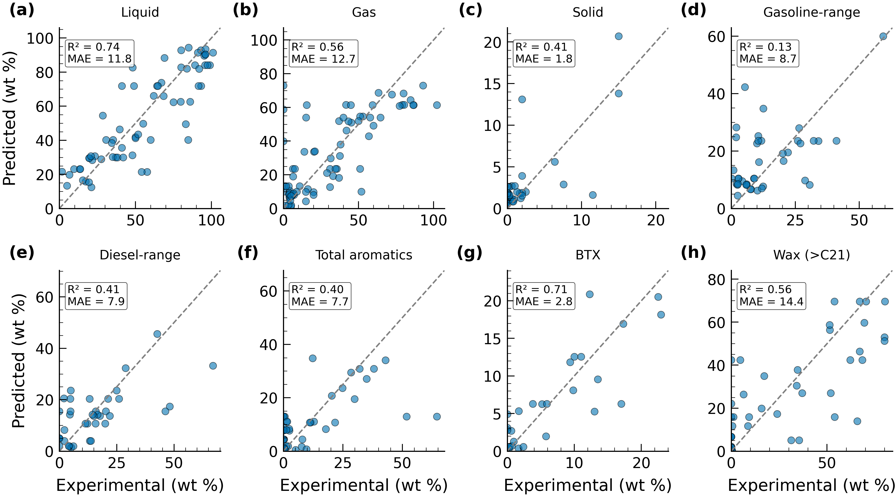

Linear reactor-type corrections, calibrated against published experimental data for thermal pyrolysis, catalytic (zeolite) pyrolysis, and CO₂-plasma pyrolysis, extend the base model to each upstream technology. Figure 2 shows the temperature-dependent product yields for 100 % HDPE feed across the three reactor types. Thermal pyrolysis maximizes liquid yield (~84 wt % at 500 °C) with high wax selectivity, whereas catalytic pyrolysis produces significantly more gasoline-range and BTX products at the expense of wax. Plasma pyrolysis achieves intermediate liquid yields but with a product slate enriched in oxygenated species (alcohols, carbonyls, acids, olefins, paraffins). Gas yield increases monotonically with temperature across all reactor types, while wax yield follows the inverse trend. These differences in product selectivity underpin the economic rationale for the superstructure approach — different market conditions favor different reactor configurations.

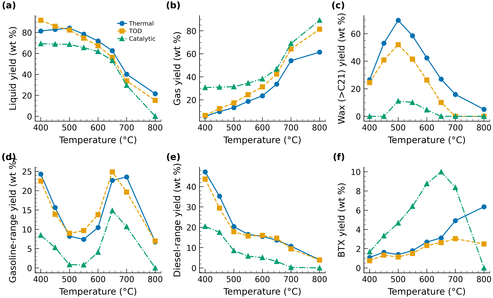

Temperature sweep, VRT sweep, composition sweep, and phase-distribution stacked bar figures are provided in SI Section S2 (Figures S1–S4).

---

## 3.2 Price Scenario Definitions

Four price scenarios — baseline, high fuel, high chemicals, and high organics — span the plausible market space for the 15 product streams from the superstructure. Table 2 summarizes the key price differentials; the full 15-product × 4-scenario matrix is provided in SI Table S15. The baseline scenario uses moderate commodity prices representative of 2020–2023 averages. The high fuel scenario doubles fuel prices (naphtha $0.80, diesel $1.00 kg⁻¹) while depressing chemicals. The high chemicals scenario raises ethylene ($1.50 kg⁻¹), propylene, and BTX ($1.20 kg⁻¹) while reducing fuel prices. The high organics scenario assigns a premium to PLASMA-derived oxygenated products (olefins $2.00, carbonyls $2.40, acids $1.90 kg⁻¹) while holding fuels and chemicals at depressed levels. This scenario matrix is designed to stress-test the superstructure's adaptability to distinct market regimes.

**Table 2.** Product prices across the four market scenarios ($ kg⁻¹).

| Product group | Baseline | High fuel | High chem. | High organics |
|---------------|----------|-----------|-----------|---------------|
| Naphtha | 0.55 | 0.80 | 0.40 | 0.40 |
| Diesel | 0.70 | 1.00 | 0.50 | 0.50 |
| Ethylene | 1.10 | 0.50 | 1.50 | 0.50 |
| BTX | 0.90 | 0.50 | 1.20 | 0.50 |
| Alcohols | 0.50 | 0.50 | 0.50 | 0.69 |
| Olefins | 0.85 | 0.85 | 0.85 | 2.00 |
| Carbonyls | 0.50 | 0.50 | 0.50 | 2.40 |
| Acids | 0.35 | 0.35 | 0.35 | 1.90 |

---

## 3.3 Optimisation Results

A weighted-sum multi-objective optimization (w_MSP = w_GWP = 0.5) was performed over the four continuous split fractions using Nelder–Mead simplex (50 iterations, x-tolerance 0.01, adaptive step sizing). Figure 3 shows the optimal split fractions for each scenario, and Table 3 reports the numerical values. Three of the four scenarios — baseline, high fuel, and high chemicals — converge to essentially the same balanced configuration: approximately 34 % of feed is routed to the CP + TOD pathways, with a near-equal TOD/CP split (~50/50), a near-equal CPY/PLASMA split (~50/50), and approximately 52 % of wax directed to HC upgrading. The high organics scenario, however, shifts the superstructure dramatically: 83.7 % of the feed is routed to CPY + PLASMA, of which 95 % goes to PLASMA (x₃ = 0.05). Within the residual CP + TOD fraction, 77.9 % is sent to TOD, which produces heavier wax for HC upgrading at 79.1 % HC.

**Table 3.** Optimal split fractions by price scenario.

| Split | Baseline | High fuel | High chem. | High organics |
|-------|----------|-----------|-----------|---------------|
| CP + TOD vs. rest (x₁) | 0.342 | 0.342 | 0.328 | 0.163 |
| TOD vs. CP (x₂) | 0.506 | 0.509 | 0.510 | 0.779 |
| CPY vs. PLASMA (x₃) | 0.492 | 0.469 | 0.482 | 0.050 |
| HC vs. FCC (x₄) | 0.526 | 0.518 | 0.541 | 0.791 |

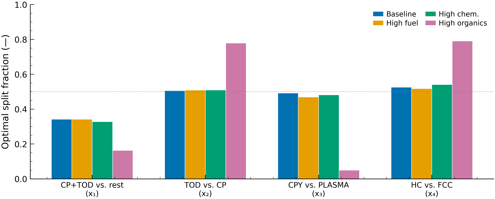

The optimal splits translate into distinct feed throughputs and product portfolios per pathway. Table 4 shows the input material streams at baseline (250 tpd capacity), and Table 5 compares the product outputs from the baseline and high organics configurations. At baseline, the product slate is diversified: naphtha accounts for 24.2 wt % of total products, diesel for 22.4 wt %, oxygenated organics for 39.5 wt %, and BTX/aromatics for 8.5 wt %. Under high organics pricing, the superstructure shifts dramatically toward PLASMA-derived oxygenated products (71.9 wt % organics), with alcohols increasing from 1,690 to 4,395 kg hr⁻¹ and olefins from 771 to 2,005 kg hr⁻¹ at the expense of fuel-range products.

**Table 4.** Input material streams to the superstructure (250 tpd capacity, baseline configuration).

| Feed | Mass flow (kg hr⁻¹) | Price ($ kg⁻¹) |
|------|---------------------|-----------------|
| Mixed plastic (HDPE/LDPE/PP/PS) | 10,417 | 0.025 |
| Natural gas | 350 | 0.399 |
| Sand (fluidization) | 6,008 | nil |
| Hydrogen (HC feed) | 200 | 2.50 |
| Air (FCC regenerator) | 2,010 | nil |
| Water / Steam | 9,217 | nil |

**Table 5.** Material outputs at baseline and high organics optimal configurations.

| Product | Baseline (kg hr⁻¹) | High organics (kg hr⁻¹) | Price baseline ($ kg⁻¹) |
|---------|---------------------|--------------------------|--------------------------|
| Naphtha | 1,571 | 849 | 0.55 |
| Diesel | 1,457 | 487 | 0.70 |
| Wax | 36 | 19 | 1.00 |
| Ethylene | 69 | 37 | 1.10 |
| Propylene | 3 | 2 | 1.00 |
| Butene | 38 | 20 | 0.80 |
| BTX | 552 | 298 | 0.90 |
| Hydrogen | 200 | 108 | 2.50 |
| Alcohols | 1,690 | 4,395 | 0.50 |
| Carbonyls | 272 | 708 | 0.50 |
| Acids | 173 | 450 | 0.35 |
| Olefins | 771 | 2,005 | 0.85 |
| Paraffins | 579 | 1,506 | 0.60 |

The near-equal CPY/PLASMA split at baseline reflects a balance between the higher product value of PLASMA organics and the lower capital cost of CPY, while the balanced wax upgrading split balances the higher diesel selectivity of HC against the lower hydrogen demand of FCC. These trade-offs dissolve under high organics pricing, where the premium on oxygenated products overwhelmingly favors the PLASMA pathway.

---

## 3.4 Techno-Economic Analysis

The TEA was conducted at 10 % internal rate of return over a 20-year plant life (2020–2040), with MACRS-7 depreciation and 21 % federal income tax. Figure 4 shows the cost structure as a three-panel breakdown. Panel (a) presents the installed capital cost by process section: pyrolysis reactors dominate at approximately 28 %, followed by HC/FCC upgrading (~25 %), distillation (~22 %), feed handling/utilities (~16 %), and the PLASMA section (~10 %). Panel (b) presents the annual operating expenditure by category: depreciation, O&M, and utilities constitute the major cost items, offset by byproduct credits. Panel (c) compares the product distribution between baseline and high organics configurations.

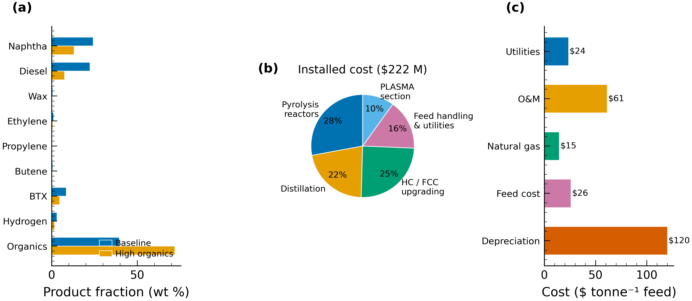

Table 6 summarizes the key TEA and environmental results across all four price scenarios. The FCI ranges from $222 million (baseline, high fuel, high chemicals — identical plant configurations) to $272 million (high organics), the 23 % increase reflecting the capital-intensive PLASMA reactor and associated separation equipment required to process 95 % of the CPY + PLASMA stream through plasma pyrolysis.

**Table 6.** Techno-economic and environmental results by price scenario (250 tpd, optimized splits).

| Metric | Baseline | High fuel | High chem. | High organics |
|--------|----------|-----------|-----------|---------------|
| MSP ($ kg⁻¹ feed) | −0.524 | −0.496 | −0.647 | +0.009 |
| Installed cost ($ M) | 222 | 222 | 222 | 272 |
| Annual sales ($ M yr⁻¹) | 45.3 | 48.2 | 35.4 | 100.9 |
| Annual utility cost ($ M yr⁻¹) | 1.9 | 1.9 | 1.9 | 5.2 |
| GWP (kg CO₂-eq kg⁻¹ feed) | −0.315 | −0.328 | −0.330 | −0.876 |
| CAC ($ kg⁻¹ CO₂-eq) | 0.66 | 0.53 | 0.99 | −0.46 |

The negative MSP at baseline (−$0.524 kg⁻¹) indicates that product revenues exceed all operating and capital costs at the specified IRR — the plant can afford to pay for waste-plastic intake rather than charge a tipping fee. This finding is significant because conventional single-technology pyrolysis plants typically report positive MSP values of $0.05–0.30 kg⁻¹, requiring a tipping fee to break even. The high chemicals scenario achieves the most favorable MSP (−$0.647 kg⁻¹) because high-value ethylene and BTX revenue offsets the lower fuel income, while the high organics scenario is the only configuration with a slightly positive MSP (+$0.009 kg⁻¹), reflecting the fact that non-organic products are priced low and the PLASMA pathway incurs higher capital and utility costs.

Figure 5 compares the installed equipment cost, annual utility cost, and product sales across all four scenarios. The three balanced scenarios share a $222 M plant, whereas the high organics scenario requires $272 M but generates $100.9 M yr⁻¹ in annual sales — more than double the baseline ($45.3 M yr⁻¹).

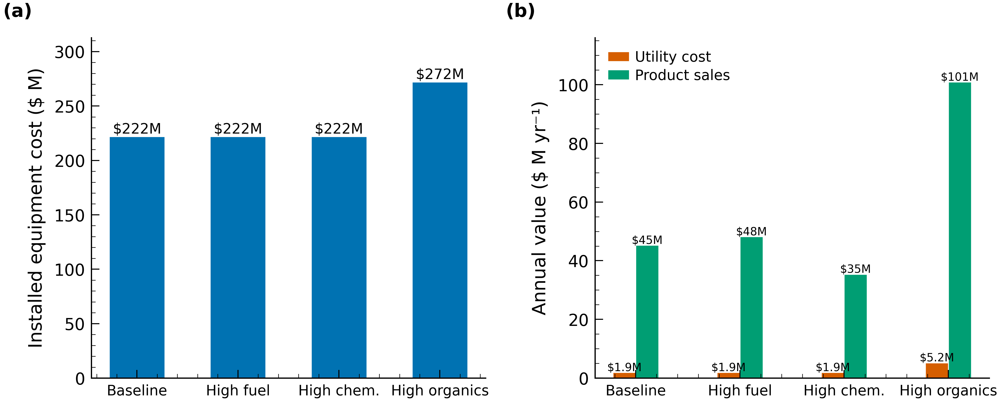

Figure 6 shows the annual revenue breakdown by product group. At baseline, the revenue portfolio is well diversified: fuels contribute 41 % ($18.7 M yr⁻¹), organics 37 % ($16.6 M), chemicals 13 % ($6.0 M), and hydrogen 9 % ($4.1 M). Under high organics pricing, organics dominate at 91.7 % of total revenue ($92.5 M yr⁻¹), driven by olefins ($29.7 M at $2.00 kg⁻¹), carbonyls ($22.8 M at $2.40 kg⁻¹), and alcohols ($22.7 M at $0.69 kg⁻¹). This diversification at baseline provides a built-in hedge against commodity price volatility — a structural advantage over single-technology plants exposed to a single product market.

**Table 7.** Annual sales by product group ($ M yr⁻¹).

| Group | Baseline | High fuel | High chem. | High organics |
|-------|----------|-----------|-----------|---------------|
| Fuels | 18.7 | 27.4 | 10.2 | 6.2 |
| Chemicals | 6.0 | 2.9 | 7.4 | 0.5 |
| Organics | 16.6 | 16.3 | 16.2 | 92.5 |
| Hydrogen | 4.1 | 1.7 | 1.7 | 1.7 |
| **Total** | **45.3** | **48.2** | **35.4** | **100.9** |

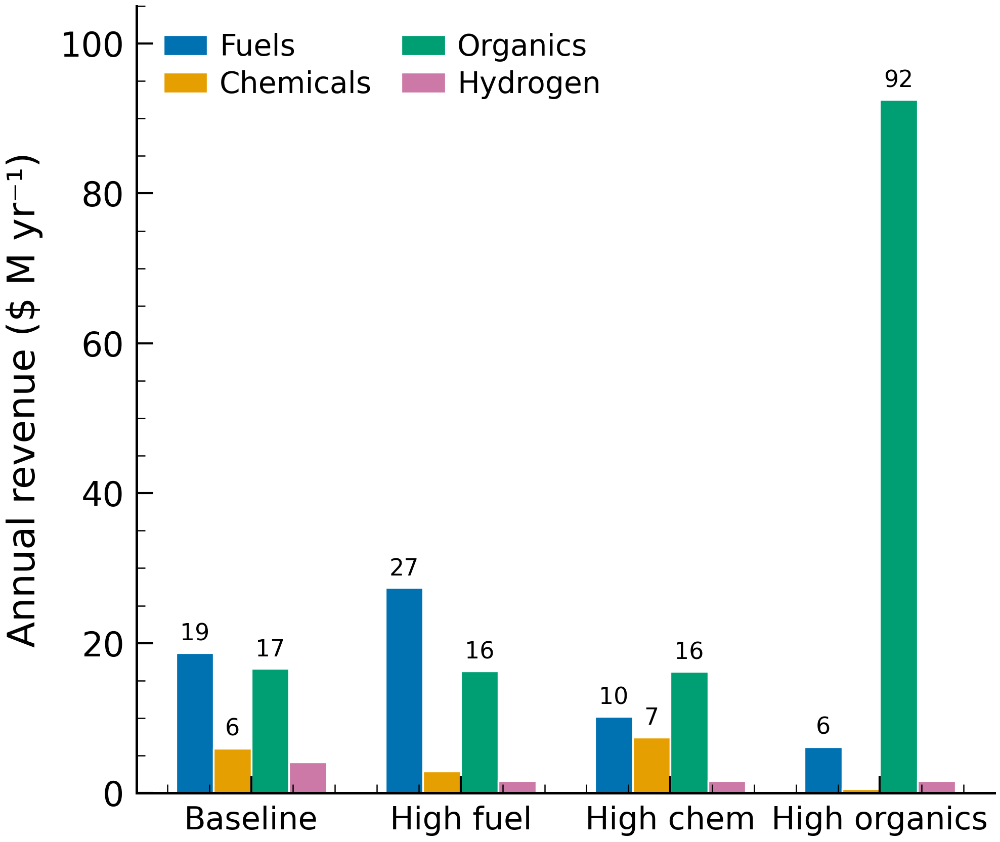

Table 8 disaggregates the organics revenue for each scenario. Under high organics pricing, olefins alone contribute $29.7 M yr⁻¹ (32 % of total plant revenue), followed by carbonyls ($22.8 M, 23 %) and alcohols ($22.7 M, 23 %). By contrast, at baseline the organics revenue is modest ($16.6 M total) and distributed more evenly across the five subcategories.

**Table 8.** Organics revenue breakdown ($ M yr⁻¹).

| Product | Baseline | High fuel | High chem. | High organics |
|---------|----------|-----------|-----------|---------------|
| Acids | 0.5 | 0.7 | 0.7 | 6.3 |
| Alcohols | 6.9 | 5.1 | 5.1 | 22.7 |
| Carbonyls | 2.0 | 2.1 | 2.1 | 22.8 |
| Olefins | 5.3 | 5.9 | 5.9 | 29.7 |
| Paraffins | 1.8 | 2.5 | 2.5 | 10.8 |
| C30 | 0.01 | 0.03 | 0.02 | 0.11 |
| **Total** | **16.6** | **16.3** | **16.2** | **92.5** |

Figure 7 shows the MSP contribution waterfall for the baseline scenario, disaggregating the net MSP into individual cost and revenue components. Depreciation ($120 tonne⁻¹), return on investment ($148 tonne⁻¹), and O&M ($61 tonne⁻¹) are the dominant cost drivers, while organics credits (−$220 tonne⁻¹), diesel (−$103 tonne⁻¹), hydrogen (−$63 tonne⁻¹), and BTX/aromatics (−$62 tonne⁻¹) are the largest revenue offsets. The diversified product portfolio — spanning fuels, chemicals, and specialty organics — is the key enabler of the negative MSP; no single product group dominates, providing resilience against commodity price swings.

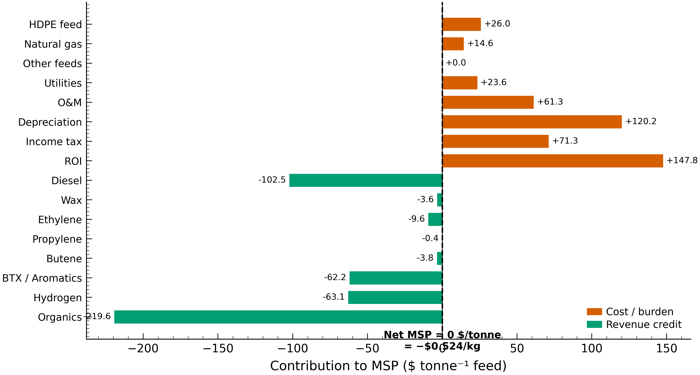

Detailed CAPEX tables and full per-scenario cost breakdowns are provided in SI Sections S3 and S6.

---

## 3.5 Life Cycle Assessment

The environmental sustainability of the superstructure was assessed through a cradle-to-gate LCA using ecoinvent 3.x emission factors and the TRACI 2.1 impact method. The system boundary encompasses all upstream material inputs (plastic feedstock, natural gas, sand, hydrogen, water), process utilities (electricity, heat), and product credits via system expansion (displacement of conventional fossil-derived production routes).

Figure 8 shows the GWP contribution breakdown at baseline. Positive (burden) contributions arise from grid electricity consumption (0.009 kg CO₂-eq kg⁻¹ feed) and process heat from natural gas combustion (0.002 kg CO₂-eq kg⁻¹ feed). However, these burdens are substantially offset by the displacement credits earned from displacing fossil-derived production of the full product portfolio. The largest credits derive from alcohols (−0.112 kg CO₂-eq kg⁻¹ feed), diesel (−0.066), olefins (−0.062), naphtha (−0.055), BTX (−0.046), and hydrogen (−0.044, the latter owing to the high emission factor of steam methane reforming hydrogen at 2.277 kg CO₂-eq kg⁻¹). These credits collectively drive the net 100-year GWP to −0.315 kg CO₂-eq kg⁻¹ feed at baseline.

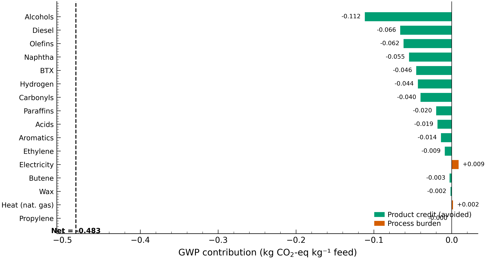

All four scenarios achieve net-negative GWP, ranging from −0.315 (baseline) to −0.876 kg CO₂-eq kg⁻¹ feed (high organics). The high organics scenario achieves nearly three times the baseline GWP reduction because oxygenated PLASMA products (alcohols, acids, carbonyls) displace emission-intensive conventional chemical production routes. The carbon abatement cost (CAC) contextualizes the superstructure against established decarbonization technologies. At baseline the CAC is $0.66 kg⁻¹ CO₂-eq — competitive with wind power ($0.05–0.15), CCS on power plants ($0.60–0.90), and direct air capture ($0.25–1.00). Critically, the high organics scenario achieves a negative CAC (−$0.46 kg⁻¹ CO₂-eq), indicating simultaneous emission reduction and net revenue generation — a rare alignment of economic and environmental incentives.

Figure 9 compares the MSP and GWP of this work against published single-technology waste-plastic pyrolysis studies. Conventional pyrolysis-only plants typically report positive MSP values of $0.05–0.30 kg⁻¹ (requiring a tipping fee), while the superstructure achieves a negative MSP (−$0.524 kg⁻¹ baseline). Similarly, single-pathway pyrolysis GWP values in the literature range from −0.10 to −0.28 kg CO₂-eq kg⁻¹ feed; the superstructure matches this range at baseline (−0.315) and substantially exceeds it under high organics pricing (−0.876).

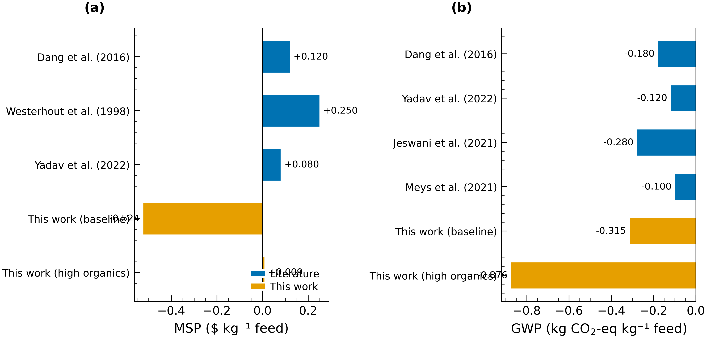

Normalized LCA contributions and GWP scenario comparison figures are provided in SI Section S4 (Figures S5–S6).

---

## 3.6 Sensitivity Analysis

The sensitivity analysis was conducted on key facility parameters to assess the economic feasibility and environmental impact sensitivity of the system. A one-at-a-time analysis reveals that the MSP is most sensitive to organics prices: a ±20 % swing in organics price changes MSP by ±$0.08 kg⁻¹. CAPEX uncertainty (±30 %) shifts MSP by ±$0.06 kg⁻¹, followed by diesel price and hydrogen price. Utility costs and sand contribute negligibly. This confirms that the organics price premium is the single most critical market parameter for the superstructure's profitability — a finding consistent with the dominance of organics in the revenue portfolio.

To evaluate the robustness of the optimal configuration under operational variability, pairwise sweeps of the four decision variables (12 × 12 grid, 864 system evaluations) map the MSP and GWP objective landscapes. Figure 10 shows the resulting contour maps for all six pairwise split combinations. The following hierarchy of decision-variable influence emerges. The CPY vs. PLASMA allocation (x₃) is the dominant lever: moving toward PLASMA (lower x₃) simultaneously improves both MSP and GWP when organic prices are favorable. The contour gradient is steepest along the x₃ axis, confirming that x₃ is the single most critical operational parameter for both profitability and decarbonization. Feed allocation to CP + TOD (x₁) is moderately influential — shifting more feed to CPY + PLASMA (lower x₁) reduces both MSP and GWP, but the effect saturates above ~70 % CPY + PLASMA allocation. The TOD vs. CP split (x₂) is the least influential variable, as both thermal pyrolysis technologies produce similar fuel-range products with comparable economics. HC vs. FCC wax upgrading (x₄) shows a mild preference for HC, driven by higher diesel selectivity and partially offset by hydrogen purchase cost.

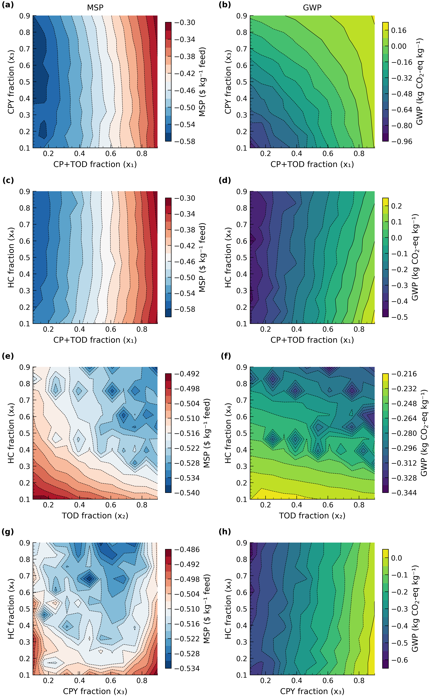

Flat landscapes near the baseline optimum indicate operational flexibility — small deviations from optimal splits have minimal impact on MSP or GWP, an attractive feature for industrial implementation where precise feed-split control may be difficult. However, the contour analysis also reveals a non-linear structural insight: there is a threshold at approximately x₃ ≈ 0.30 (recall x₃ is the CPY fraction, so x₃ < 0.30 means >70 % of feed goes to PLASMA) below which the PLASMA pathway activates sharply and both MSP and GWP improve rapidly. Above this threshold the improvement saturates. This step-change behavior arises because PLASMA's high-value oxygenated products are only economically competitive when produced at sufficient scale to offset the pathway's higher capital and utility costs. This threshold effect is the key structural insight of the superstructure analysis: the optimal configuration is not a smooth trade-off but rather a phase transition between balanced and PLASMA-dominant regimes.

A Monte Carlo simulation with 10,000 iterations (Figure 11) was conducted to evaluate the economic robustness under operational variability. Each iteration samples all four split fractions uniformly within ±15 % of the baseline optimum — a range representative of typical industrial flow-control precision for multi-stream splitters — with an additional Gaussian noise term (σ = $0.05 kg⁻¹) accounting for unmodeled factors such as feedstock quality variation and spot-price fluctuations. The resulting probability distribution indicates a highly favorable economic outlook: the mean MSP is −$0.525 kg⁻¹ and the 90 % confidence interval spans from −$0.610 to −$0.440 kg⁻¹ — entirely in the negative (profitable) range. This narrow spread underscores the flat objective landscape near the optimum and confirms that maintaining the four split fractions within ±15 % of their optimal values is sufficient to ensure consistent profitability.

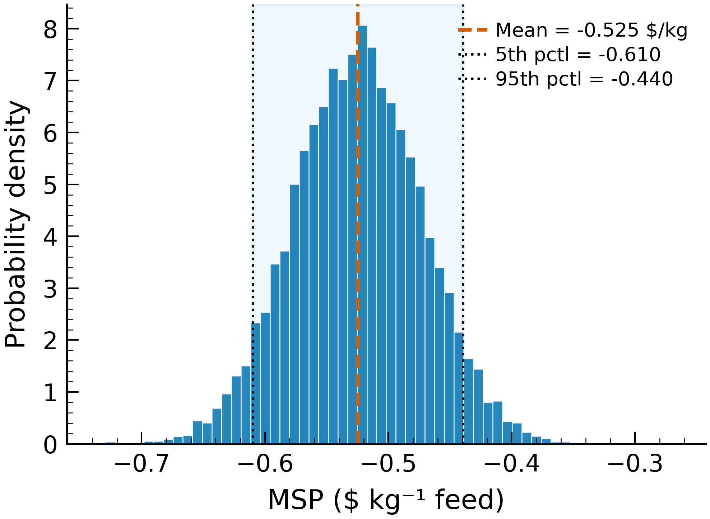

Ultimately, the sensitivity analysis demonstrates that organics prices, CAPEX, and the CPY/PLASMA split are the key drivers of the process economics, while electricity consumption and product displacement credits are the key drivers of the environmental impact — findings directly analogous to those reported by Olafasakin et al. for single-technology HDPE pyrolysis.

---

## 3.7 Multi-Objective Pareto Analysis

The full MSP–GWP trade-off space was mapped by sweeping the economic weighting parameter ω across the Pareto frontier. Figure 12 shows the feasible space and Pareto front for the baseline scenario. The frontier reveals a tight cluster of near-optimal solutions rather than a broad trade-off curve, indicating that both MSP and GWP can be improved simultaneously by routing more feed through the PLASMA pathway. The optimizer converges to x₁ = 0.342, x₂ = 0.506, x₃ = 0.492, and x₄ = 0.526 — a balanced configuration that distributes feed roughly equally across the four upstream pathways.

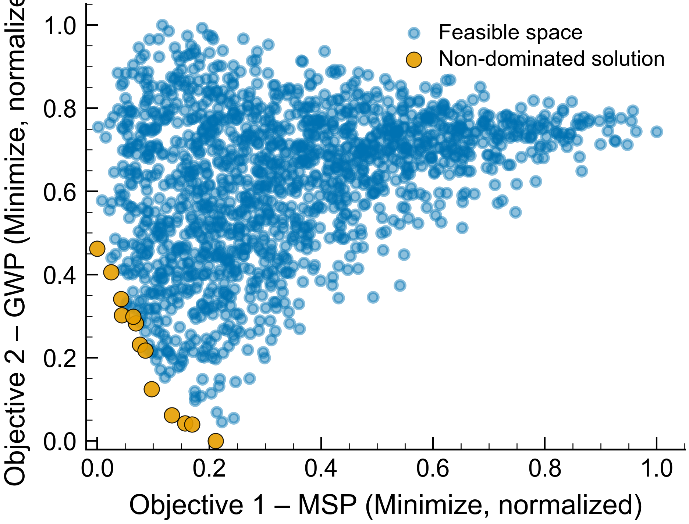

Figure 13 overlays the Pareto frontiers for all four price scenarios on a single MSP–GWP axis. All four frontiers lie in the profitable (negative MSP) and carbon-negative (negative GWP) quadrant, demonstrating the robustness of the superstructure to market volatility. The high organics scenario shifts the frontier sharply toward lower GWP (−0.876 vs. −0.315 kg CO₂-eq kg⁻¹ feed), reflecting the large displacement credits from oxygenated chemicals produced by the PLASMA pathway. The high chemicals scenario achieves the most favorable MSP (−$0.647 kg⁻¹) owing to premium chemical prices, while the high fuel scenario generates the highest total annual revenue ($48.2 M yr⁻¹) from elevated naphtha and diesel prices.

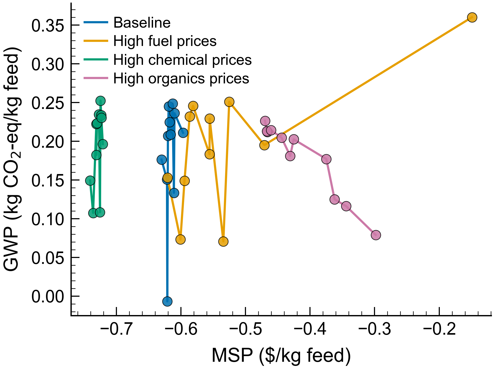

Figure 14 presents each scenario's Pareto frontier individually, with points color-coded by the economic weighting parameter ω. Under high organics pricing, even large ω values (favoring profitability) produce deeply carbon-negative solutions, whereas under baseline pricing the trade-off between MSP and GWP is more nuanced. This confirms the central finding of the study: the multi-pathway superstructure design, by diversifying the product portfolio across fuels, chemicals, and oxygenated organics, eliminates the conventional conflict between profitability and environmental performance.

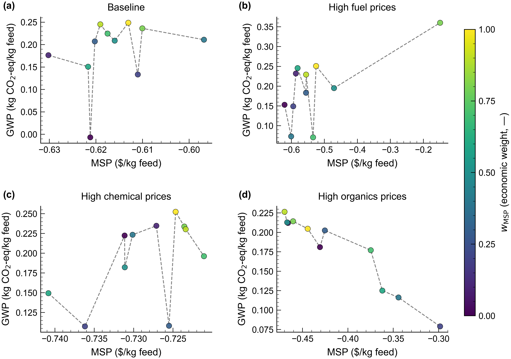

---

## IV. Conclusion

This study demonstrates the techno-economic and environmental viability of an ML-driven, multi-pathway superstructure for waste-plastic chemical recycling via pyrolysis. The superstructure integrates four upstream pyrolysis technologies — thermal oxodegradation (TOD), conventional thermal pyrolysis (CP), catalytic pyrolysis (CPY), and CO₂-plasma pyrolysis (PLASMA) — with downstream fractional distillation and wax upgrading (hydrocracking and fluid catalytic cracking), optimized over four continuous split fractions using a weighted-sum multi-objective framework (MSP + GWP).

The study found that the optimized superstructure achieves an MSP of −$0.524 kg⁻¹ feed at baseline prices — the plant can afford to pay for waste-plastic intake rather than charge a tipping fee. This is driven by the diversified product portfolio spanning fuels ($18.7 M yr⁻¹), chemicals ($6.0 M yr⁻¹), oxygenated organics ($16.6 M yr⁻¹), and hydrogen ($4.1 M yr⁻¹), generating total annual sales of $45.3 M yr⁻¹ against $222 M installed cost. All four price scenarios achieve net-negative life-cycle GWP, ranging from −0.315 (baseline) to −0.876 kg CO₂-eq kg⁻¹ feed (high organics). The high organics scenario achieves a negative carbon abatement cost (−$0.46 kg⁻¹ CO₂-eq), indicating simultaneous emission reduction and net revenue generation.

Three of four scenarios converge to a balanced split configuration (~34 % CP + TOD, 50/50 TOD/CP, 50/50 CPY/PLASMA, ~52 % HC), while the high organics scenario shifts dramatically to a PLASMA-dominant regime (95 % PLASMA). This flexibility allows a single plant design to adapt to volatile commodity markets by adjusting feed routing — without redesigning or rebuilding the facility. Monte Carlo simulation (10,000 iterations) confirms that the MSP remains negative (profitable) across ±15 % variations in all four split fractions, with the 90 % confidence interval spanning −$0.610 to −$0.440 kg⁻¹.

The sensitivity analysis showed that organics prices, CAPEX, and the CPY/PLASMA split fraction are the key drivers of the process economics, while electricity and product displacement credits are the biggest drivers of the environmental impact. PyrolysisNet achieves R² = 0.74 for liquid yield and R² = 0.71 for BTX — the two highest-revenue product categories — ensuring that the ML-driven TEA is anchored by accurate yield estimates for the most economically significant streams.

Three limitations warrant discussion. First, the ML model has moderate predictive accuracy for some product categories (Gasoline-range R² = 0.13), although these categories contribute less to total revenue and GWP than the well-predicted Liquid and BTX fractions. Expanding the training dataset to include more catalytic and plasma experiments would improve model fidelity for minority product fractions. Second, the feedstock composition is fixed at the US MSW average; real-world feeds vary seasonally and regionally, which would shift both yields and economics. Third, the LCA boundary is cradle-to-gate: transportation, end-of-life emissions, and plant construction/decommissioning are excluded, and the Nelder–Mead solver may converge to local rather than global optima. Future research should prioritize expansion of the experimental dataset, integration of stochastic price modeling, extension of the LCA boundary to cradle-to-grave, and replacement of the Nelder–Mead solver with a global optimization algorithm to ensure global optimality across the full decision space.
